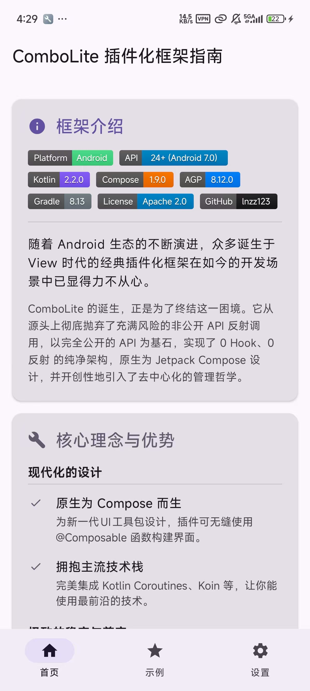
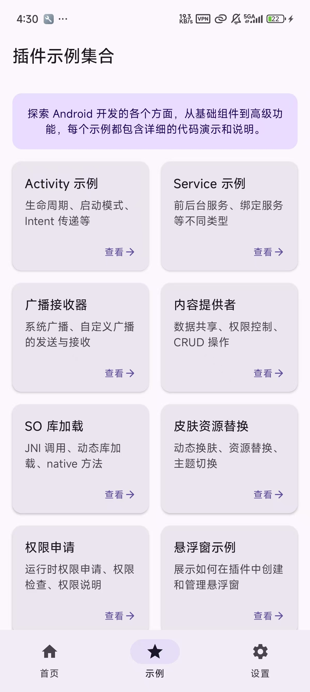
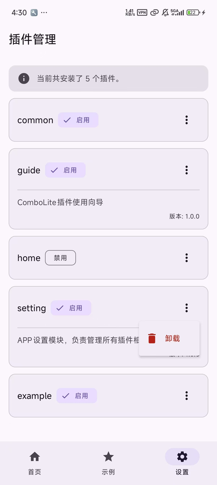
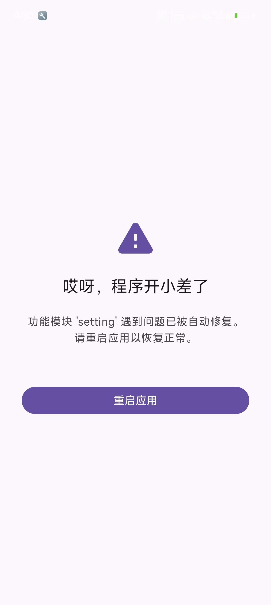
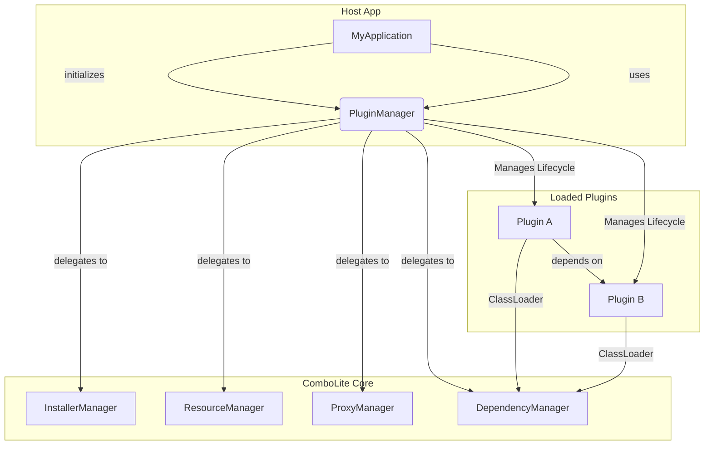

<p align="right">
  <b>简体中文</b> | <a href="./README_en.md">English</a>
</p>

# ComboLite: The Next-Generation Plugin Framework for Android

<p align="center">
  
  
  <a href="https://kotlinlang.org/"></a>
  <a href="https://developer.android.com/jetpack/compose"></a>
  <a href="https://developer.android.com/studio/releases/gradle-plugin"></a>
  <a href="https://gradle.org/"></a>
  <a href="https://github.com/lnzz123/ComboLite/blob/main/LICENSE"></a>
  <a href="https://github.com/lnzz123"></a>
</p>

🚀 为 Jetpack Compose
打造的新一代安卓插件化框架。一个现代、稳定、灵活的插件化解决方案。核心特性：原生Compose支持 |
100%官方API | 0 Hook & 0 反射 | 去中心化架构**

---

随着 Android 生态的不断演进，众多诞生于 View
时代的经典插件化框架放现在的开发场景已经显得力不从心。其中多数项目已停止维护，其庞大而晦涩的内部实现、对**
非公开API（Hook与反射）**的过度依赖，以及高昂的接入成本，使其在面对系统频繁更新时，愈发显得格格不入。

**`ComboLite` 的诞生，正是为了终结这一困境，为 Android 开发者提供一个现代化、稳定、灵活的插件化框架。**

ComboLite 专为现代化 Android 开发而生。从源头上彻底抛弃了充满风险的非公开 API 反射调用，以完全公开的
API 为基石，实现了 0 Hook、0 反射 的纯净架构，逻辑清晰、接入轻便。它原生为 Jetpack Compose
设计，并开创性地引入了去中心化的管理哲学，在保证极致稳定性的前提下，赋予开发者前所未有的灵活性。

无论你是想构建一个所有功能皆可插拔的“空壳”应用，还是想为现有项目赋予动态化能力，`ComboLite`
都将是你最可靠、最现代化的选择。

## 📸 示例项目 (Screenshots)

下载示例App：https://github.com/lnzz123/ComboLite/releases

|          安装启动插件           |          安装启动插件2          |          示例插件页面           |
|:-------------------------:|:-------------------------:|:-------------------------:|
|  |  |  |

|          示例插件页面2          |          去中心化管理           |         崩溃熔断与自愈提示         |
|:-------------------------:|:-------------------------:|:-------------------------:|
|  |  |  |

## ✨ 核心理念与优势

`ComboLite` 的设计哲学根植于四个核心原则：

#### 1\. 现代化的设计 (Modern by Design)

* **原生为 Compose 而生**: `ComboLite` 是为满足新一代 Android UI 工具包 Jetpack Compose
  的需求而设计的。插件可以无缝使用 `@Composable` 函数构建界面，享受声明式 UI 带来的开发便利。
* **拥抱主流技术栈**: 完美集成 Kotlin Coroutines、StateFlow，并采用 Koin
  进行依赖注入，让你在插件开发中也能使用最前沿、最高效的技术。
* **最新的工具链**: 基于最新版 Android Studio、Gradle 和 AGP 构建，杜绝了老旧框架因工具链不兼容带来的集成噩梦。

#### 2\. 极致的稳定与兼容 (Stability & Compatibility)

* **0 Hook, 0 反射**: 这是 ComboLite 最核心的承诺。我们完全基于 Android 官方推荐的 ClassLoader
  机制，不使用任何 Hook。在Resources资源加载方面，我们优先使用最新的官方 API，仅在兼容 Android 11
  以下的旧版系统时，才采用了业界标准的、稳定可靠的反射方案。这意味着框架主体拥有无与伦比的稳定性和对未来
  Android 版本的天然兼容性。
* **广泛的系统支持**: 理论上支持从 Android 7.0 (API 24) 到 Android 16+ 的所有版本，让你无需担心系统碎片化问题。
* **智能的依赖解析与修复**: 框架拥有强大的**动态依赖解析能力**
  。插件间的依赖关系无需预先配置，会在类加载时被自动发现并动态构建成依赖图。当您需要更新或重启一个核心插件时，
  `ComboLite` 提供的**链式重启机制**会自动卸载并重载所有受影响的上游插件，从而完美修复因热更新导致的类加载器冲突问题，确保依赖链的绝对一致性。
* **崩溃熔断与自愈**: `ComboLite` 内置了一个强大的**插件崩溃处理器** (`PluginCrashHandler`)
  。当插件因缺少依赖而导致 `ClassNotFoundException` 时，框架会捕获这个专有的
  `PluginDependencyException`，并执行一系列自愈操作：
    * **精准定位**: 准确识别出是哪个插件引发了崩溃。
    * **自动熔断**: 自动**禁用**这个有问题的插件，防止应用在下次启动时陷入无限崩溃的循环。
    * **优雅降级**: 引导用户到一个友好的错误提示页面，而不是直接闪退，极大地提升了用户体验。

  这个机制将一个潜在的、导致整个应用瘫痪的致命错误，转化为一个可隔离、可恢复的局部问题，从而最大限度地保障了宿主应用的稳定性。

#### 3\. 终极的灵活与解耦 (Flexibility & Decoupling)

* **去中心化架构**: 打破了传统“宿主-插件”的强中心化模式。任何插件都拥有管理（下载、安装、更新、卸载）自身或其他插件的能力，可以轻松实现“插件商店”、“按需下载”等高级功能。
* **“空壳”宿主支持**: 宿主 App 可以没有任何业务逻辑，完全退化为一个启动入口。所有功能、所有 UI
  均可由插件动态提供。
* **灵活的插件形态**: 一个标准的 Android `Application` 或 `Library` (AAR)
  库项目，都可以被轻松打包成一个独立的插件，极大地降低了插件开发和迁移的门槛。

#### 4\. 卓越的开发者体验 (Developer Experience)

* **轻量级核心**: 框架核心模块仅包含十几个核心类，依赖库除了 Koin 和 dexlib2 (用于类索引)
  外几乎没有其他第三方库，对应用体积影响极小。
* **微乎其微的侵入性**: 集成 `ComboLite` 几乎不需要改动你项目的原有结构。你的插件代码可以像开发一个普通的
  App 或 Module 一样自然。
* **闪电般的类查找**: 通过在加载时为所有插件建立全局类索引，`ComboLite` 实现了 `O(1)`
  时间复杂度的跨插件类查找，彻底告别了传统插件框架中普遍存在的类查找性能瓶颈。

## 🏗️ 架构概览

`ComboLite` 采用简洁而强大的微核设计，由几个核心组件协同工作。



- **`PluginManager`**: 框架的中心协调器（单例），负责插件的加载、卸载、重启和生命周期管理。
- **`InstallerManager`**: 负责插件的安装、更新和合法性校验。
- **`ResourceManager`**: 负责插件资源的加载与管理，兼容新旧 Android 版本。
- **`ProxyManager`**: 负责 Android 四大组件的代理和生命周期分发。
- **`DependencyManager`**: 负责维护插件间的动态依赖关系图和类索引。

## 🚀 快速开始

集成 `ComboLite` 只需简单的三步。

### 1\. 添加依赖

在你的宿主（或壳）应用的 `build.gradle.kts` 中添加核心库依赖：

```kotlin
dependencies {
    implementation(project(":combolite:core"))
}
```

### 2\. 初始化框架

`ComboLite` 提供了基类来帮助您完成一键式初始化，这是我们**推荐**的方式。

#### 方式一：继承基类（推荐）

只需让你的 `Application` 类继承自 `com.combo.core.base.BaseHostApplication`
，即可自动完成所有初始化工作，包括插件加载器、资源管理器以及崩溃处理器。

**这就是全部所需的初始化代码！**

```kotlin
// 只需继承 BaseHostApplication 即可
class MainApplication : BaseHostApplication() {
    override fun onCreate() {
        super.onCreate()
        // 你的其他应用级初始化逻辑
    }
}
```

#### 方式二：手动初始化（适用于特殊场景）

如果你的 `Application` 无法继承 `BaseHostApplication`，也可以手动进行初始化。请确保所有步骤都正确配置，以避免潜在问题。

\<details\>
\<summary\>点击展开手动初始化代码\</summary\>

```kotlin
class MainApplication : Application() {
    override fun onCreate() {
        super.onCreate()

        // 1. (重要) 注册插件崩溃处理器
        PluginCrashHandler.initialize(this)

        // 2. 初始化插件管理器
        PluginManager.initialize(this)

        // 3. 异步加载已启用的插件
        lifecycleScope.launch {
            val loadedCount = PluginManager.loadEnabledPlugins()
            Log.d("MyApp", "Successfully loaded $loadedCount plugins.")
        }
    }
}
```

\</details\>

### 3\. 创建你的第一个插件

插件可以是一个独立的 `com.android.library` 或 `com.android.application` 模块。

#### a. 实现插件入口

创建一个类并实现 `IPluginEntryClass` 接口。

```kotlin
class HomePluginEntry : IPluginEntryClass {

    // (可选) 定义此插件的 Koin 依赖注入模块
    override val pluginModule: List<Module>
        get() = listOf(
            module {
                viewModel { HomeViewModel() }
                single<IUserService> { UserServiceImpl() }
            }
        )

    // 定义插件的主界面
    @Composable
    override fun Content() {
        // 你的 Jetpack Compose 屏幕
        HomeScreen()
    }
}
```

#### b. 在 `AndroidManifest.xml` 中声明插件

在插件模块的 `AndroidManifest.xml` 中，通过 `<meta-data>` 标签声明插件信息。

```xml

<manifest>
    <application>
        <meta-data android:name="plugin.id" android:value="com.example.home" />
        <meta-data android:name="plugin.version" android:value="1.0.0" />
        <meta-data android:name="plugin.entryClass"
            android:value="com.example.home.HomePluginEntry" />
        <meta-data android:name="plugin.description" android:value="Home screen plugin" />

    </application>
</manifest>
```

你已经完成了！现在只需将插件打包成 APK，就可以通过 `PluginManager` 进行安装和启动了。

## 🔧 核心 API 用法

`PluginManager` 提供了丰富的 API 来管理和与插件进行交互。以下是一些最核心的用法示例。

### 1. 插件管理：安装、卸载与启用

插件的生命周期管理通过 `PluginManager.installerManager` 和 `PluginManager` 本身来完成。

```kotlin
// --- 安装插件 ---
// 建议在 IO 线程执行
val pluginApkFile = File("path/to/your/plugin.apk")
val installResult = PluginManager.installerManager.installPlugin(pluginApkFile)

if (installResult is InstallResult.Success) {
    val pluginId = installResult.pluginInfo.pluginId
    println("插件 [$pluginId] 安装成功!")

    // 安装成功后，可以选择立即启动它
    PluginManager.launchPlugin(pluginId)
} else {
    println("插件安装失败: ${(installResult as InstallResult.Failure).message}")
}


// --- 卸载插件 ---
val pluginToUninstall = "com.example.home"
val uninstallSuccess = PluginManager.installerManager.uninstallPlugin(pluginToUninstall)
if (uninstallSuccess) {
    println("插件 [$pluginToUninstall] 卸载成功!")
}

// --- 控制插件自启动 ---
// 禁止某个插件在下次应用启动时自动加载
PluginManager.setPluginEnabled("pluginId", false)
````

### 2\. 插件运行与交互

启动插件并获取其入口实例，是与插件功能交互的基础。

```kotlin
// --- 启动或重启插件 ---
// 如果插件未运行，则启动；如果已运行，则执行链式重启
val success = PluginManager.launchPlugin("com.example.home")

// --- 获取插件入口实例 ---
// 这允许你直接调用插件入口类中定义的方法或访问其属性
val homePlugin: IPluginEntryClass? = PluginManager.getPluginInstance("com.example.home")

// 例如，如果你的宿主 Activity 需要展示某个插件的 Compose 界面
// @Composable
// fun ShowPluginUI(pluginId: String) {
//     val plugin = PluginManager.getPluginInstance(pluginId)
//     plugin?.Content() // 调用插件的 @Composable 方法
// }
```

### 3\. 访问插件资源

如果需要，你也可以直接访问某个特定插件的 `Resources` 对象。

```kotlin
// 获取 "com.example.home" 插件的资源管理器
val pluginResources: Resources? = PluginManager.resourcesManager.getResources("com.example.home")

// 使用插件的资源 ID 来加载资源
val icon = pluginResources?.getDrawable(R.drawable.plugin_icon)
val title = pluginResources?.getString(R.string.plugin_title)
```

更多用法请参考sample项目插件示例模块

## 🔧 四大组件用法

`ComboLite` 提供了一系列优雅的 `Context` 扩展函数，让调用插件功能如原生般丝滑。

### Activity 用法

在插件中定义 Activity，继承 `BasePluginActivity`。

```kotlin
class HomeActivity : BasePluginActivity() { /* ... */ }
```

从任何地方像启动普通 Activity 一样启动它。

```kotlin
context.startPluginActivity(HomeActivity::class.java) {
    putExtra("USER_ID", 123)
}
```

### Service 用法

在插件中定义 Service，继承 `BasePluginService`。

```kotlin
class MusicService : BasePluginService() { /* ... */ }
```

框架通过**代理服务池**来管理插件 Service。你可以透明地启动、绑定和停止它们。

```kotlin
context.startPluginService(MusicService::class.java)
context.bindPluginService(MusicService::class.java, serviceConnection, Context.BIND_AUTO_CREATE)
context.stopPluginService(MusicService::class.java)
```

### BroadcastReceiver 用法

在插件中定义 Receiver，实现 `IPluginReceiver` 接口。

```kotlin
class DownloadReceiver : IPluginReceiver { /* ... */ }
```

通过 `sendInternalBroadcast` 发送广播，框架会自动将其路由到已注册的插件接收器。

```kotlin
context.sendInternalBroadcast("com.example.DOWNLOAD_COMPLETE") {
    putExtra("FILE_PATH", "/path/to/file")
}
```

### ContentProvider 用法

在插件中定义 Provider，像原生一样继承 `ContentProvider`。

```kotlin
class MyPluginProvider : ContentProvider() { /* ... */ }
```

客户端需要通过一个**特殊约定的 URI** 来访问插件 Provider。

```kotlin
// 访问插件 Provider 的 URI 约定格式:
// "content://[宿主Provider的Authority]/[插件Provider的完整类名]/[原始路径]"

val pluginProviderClassName = MyPluginProvider::class.java.name
val hostAuthority = "com.jctech.plugin.sample.proxy.provider" // 宿主代理Provider的Authority
val originalPath = "items/1"

val proxyUri = Uri.parse("content://$hostAuthority/$pluginProviderClassName/$originalPath")

// 使用 proxyUri 进行查询
context.contentResolver.query(proxyUri, null, null, null, null)
```

## 🛠️ 四大组件实现原理

* **Activity**: 通过在宿主 `AndroidManifest` 中只需要注册一个透明的 `BaseHostActivity` 作为代理“占坑”。启动插件
  Activity 时，框架会启动这个代理 Activity，并将真正的插件 Activity 类名通过 `Intent` 传递过去。
  `BaseHostActivity` 在内部完成插件 Activity 的实例化，并将其生命周期与自身进行绑定和分发。
* **Service**: 采用创新的\*\*“代理服务池”\*\*模式。你在宿主 `AndroidManifest` 中预注册多个
  `BaseHostService`。当启动一个插件 Service 时，`ProxyManager` 会从池中寻找一个空闲的代理 Service
  进行绑定，并将插件 Service 的生命周期与该代理进行关联。这使得多个插件 Service 可以同时、独立地运行。
* **BroadcastReceiver**: 框架在插件加载时，解析其 `AndroidManifest.xml` 中注册的静态广播，并由
  `ProxyManager` 进行统一管理。当系统广播传来时，由宿主中的代理 `BaseHostReceiver` 接收，然后根据
  `Action` 等信息异步分发给所有匹配的插件 `IPluginReceiver`。
* **ContentProvider**: 通过在宿主中预注册一个代理 `BaseHostProvider`，它作为所有插件 `Provider`
  的唯一入口。外部通过上文约定的特殊 `Uri` 格式来访问。代理 `Provider` 根据 `Uri` 的第一段路径解析出目标插件
  `Provider` 类名，实例化后将重写过的、符合插件原始 `Authority` 的 `Uri` 和请求一并转发给它。同时，代理层还负责了插件
  `Provider` 的 `exported` 安全检查。

## 🆚 与其他框架对比

插件化技术历经多年发展，涌现了许多优秀的开源项目。`ComboLite` 在设计之初，充分借鉴了前辈们的经验，并针对现代
Android 开发的痛点进行了革新。

我们选择与几个业界知名且具有代表性的框架进行对比，以帮助您更好地进行技术选型。

### 详细对比表

| 对比维度                | `ComboLite` (我们)        | `Shadow` (腾讯)             | `VirtualAPK` / `DroidPlugin` |
|:--------------------|:------------------------|:--------------------------|:-----------------------------|
| **实现原理**            | ✅ **官方API + 代理模式**      | 🌓 **编译期代码重写 + 运行时委托**    | 💥 **Hook 系统服务 (AMS/PMS)**   |
| **社区活跃度**           | 🚀 **活跃开发中** (2025年)    | ⚠️ **维护放缓** (最后活跃约2022年)  | ❌ **项目停滞** (最后活跃约2015-2018年) |
| **开发环境兼容性**         | ✅ **原生支持最新 AGP/Gradle** | ❌ **需使用旧版或自行魔改适配**        | ❌ **严重不兼容，基本无法使用**           |
| **Jetpack Compose** | ✅ **原生支持，核心特性**         | ❌ **不支持**                 | ❌ **不支持**                    |
| **热更新支持**           | ✅ **支持** (UI/代码/资源)     | ✅ **支持** (Activity/代码/资源) | ✅ **支持**                     |
| **四大组件支持**          | ✅ **完善支持** (代理模式)       | ✅ **Activity支持完善**，其他较复杂  | ✅ **完善支持** (Hook模式)          |
| **框架复杂度**           | ✨ **极低** (十几核心类)        | ⚠️ **高** (需理解其构建插件和运行时)   | ⚠️ **极高** (涉及大量系统服务Hook)     |
| **使用集成难度**          | ✨ **极低** (几行代码配置)       | ⚠️ **高** (需定制构建流程)        | ⚠️ **高** (需改动基类和Application) |
| **侵入性**             | ✨ **微乎其微**              | ⚠️ **较高** (强依赖其Gradle插件)  | ⚠️ **较高** (需继承特定基类)          |
| **架构模式**            | 🌐 **去中心化** (插件可互管)     | 🏠 **中心化** (宿主管理插件)       | 🏠 **中心化** (宿主管理插件)          |
| **依赖注入支持**          | ✅ **原生 Koin**           | ❌ **需自行实现**               | ❌ **需自行实现**                  |
| **App 兼容性**         | 🥇 **极高** (不依赖非公开API)   | 🥈 **较高** (绕开大部分系统限制)     | 🥉 **低** (随系统更新频繁失效)         |

### 各方案特点与权衡

#### 关于 VirtualAPK / DroidPlugin

这两个框架是**Hook方案的杰出代表**，在它们诞生的年代，通过 Hook 系统核心服务（`ActivityManagerService`,
`PackageManagerService`等），实现了近乎完美的“欺骗”系统能力，功能非常完备。

* **优点**: 在特定系统版本下，功能强大，能支持绝大多数原生App的特性。
* **权衡**: 它们的**致命弱点**在于对 Android 系统实现的强耦合。随着 Android 版本的快速迭代和厂商的深度定制，这些基于非公开
  API 的 Hook 点极易失效，导致严重的兼容性和稳定性问题。如今，它们均已**停止维护**，无法跟上现代化的
  Android 开发工具链（如 AGP 8.x），已不适合在新项目中使用。

#### 关于 Shadow

`Shadow` 是一个**设计思想极为精巧**的框架，它另辟蹊径，通过在编译期重写代码，在运行时将插件的组件调用委托给一个单独的“运行时”来执行，从而绕开了对系统服务的直接
Hook。

* **优点**: 拥有出色的 Activity 兼容性，且稳定性远高于 Hook 方案。
* **权衡**: `Shadow` 的强大能力来自于其**复杂的构建系统**。开发者需要深度依赖其定制的 Gradle
  插件，理解其独特的“宿主-运行时-插件”模型，学习曲线较为陡峭。同时，项目**维护也已放缓**，对于最新的
  Android 特性和工具链支持存在滞后。

#### 关于 ComboLite (我们)

`ComboLite` 选择了**回归官方、拥抱简单**的道路。我们认为，对于绝大多数业务场景，稳定性和可维护性远比通过“黑科技”实现某些边缘功能更为重要。

* **优点**:
    * **极致稳定**: 完全基于官方公开的代理（Proxy）模式和 `ClassLoader` 机制，不碰任何非公开
      API，天然具备跨版本、跨厂商的兼容性。
    * **拥抱现代**: 原生为 Jetpack Compose 设计，积极维护，始终跟进最新的开发工具链。
    * **简单透明**: 框架核心代码极少，逻辑清晰，集成和二次开发都非常轻松。
    * **架构灵活**: 独特的去中心化设计为应用架构提供了更多可能性。
* **权衡** (修正后的描述):
  代理模式虽然极其稳定，但相比于能深度篡改系统行为的 Hook 方案，如在处理某些复杂的 **Activity
  启动模式（LaunchMode）和任务栈（Task Affinity）管理**上，自由度会相对受限。这是因为代理 Activity 自身的
  `LaunchMode` 和任务栈行为是在宿主中预先声明的，插件无法在运行时完全动态改变它们。`ComboLite` 的选择是，在
  99% 的主流场景中提供最纯净、最简单的解决方案，而不是为了 1% 的边缘场景去牺牲整个框架的可靠性。

**总而言之，如果您正在开发一个面向未来的、使用 Jetpack Compose
等现代化技术栈、且将长期稳定性和可维护性放在首位的项目，`ComboLite` 将是您的不二之选。**

## 如何贡献

我们热切欢迎任何形式的贡献，让 `ComboLite` 变得更好！无论是提交功能建议、报告 Bug、发起 Pull
Request，还是帮助改进文档，都是对社区的巨大帮助。

* **报告 Bug 或提交建议**: 请通过 [GitHub Issues](https://github.com/lnzz123/ComboLite/issues)
  提交，这是我们进行公开讨论和追踪问题的最佳渠道。
* **贡献代码**: 请 Fork 本仓库，在您的分支上完成修改后，向上游发起 Pull Request。请确保您的代码遵循项目现有的编码规范。

如果您有更复杂的想法需要讨论，或者希望进行私下联系（例如报告安全问题），我们也非常欢迎您通过邮件联系我们。

📧 **联系邮箱**: `1755858138@qq.com`

## ❤️ 支持与赞助 (Support & Sponsor)

`ComboLite` 是一个免费的开源项目，由我利用业余时间进行开发和维护。如果这个项目对您有帮助，您的支持将是我持续投入的莫大动力。

<details>
  <summary>点击查看赞助方式 (Click to see sponsorship methods)</summary>

  <br>

  <p>您的每一份支持都意义非凡。可以通过以下方式请我喝杯咖啡 ☕️：</p>

  <table>
    <tr>
      <td align="center">支付宝 (Alipay)</td>
      <td align="center">微信支付 (WeChat Pay)</td>
    </tr>
    <tr>
      <td align="center"></td>
      <td align="center"></td>
    </tr>
  </table>
</details>

## 许可 (License)

`ComboLite` 遵循 **Apache-2.0 license** 开源许可协议。

这意味着您可以自由地：

* **商业使用**: 在您的商业产品中免费使用 `ComboLite`。
* **分发**: 自由地分发您的应用，无论它是否包含 `ComboLite`。
* **修改**: 您可以基于 `ComboLite` 的源码进行修改以满足您的需求。

您只需要遵守以下简单条件：

* **保留声明**: 在您的代码和分发包中，必须保留原始的版权和许可证声明。
* **声明变更**: 如果您修改了源代码，需要在修改的文件中做出声明。

完整的许可证内容，请查阅项目根目录下的 [LICENSE](https://github.com/lnzz123/ComboLite/blob/main/LICENSE)
文件。