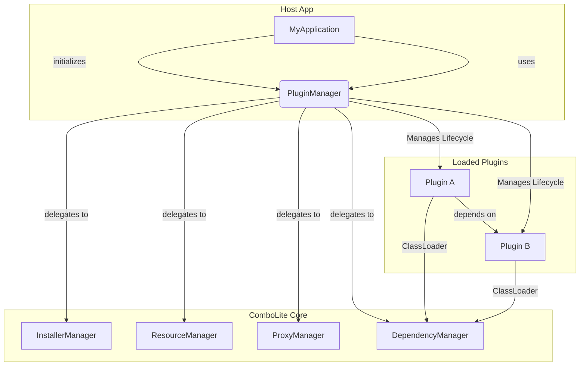

<p align="right">
<a href="./README.md">简体中文</a> | <b>English</b>
</p>

# ComboLite: The Next-Generation Plugin Framework for Android

<p align="center">
  
  
  <a href="https://kotlinlang.org/"></a>
  <a href="https://developer.android.com/jetpack/compose"></a>
  <a href="https://developer.android.com/studio/releases/gradle-plugin"></a>
  <a href="https://gradle.org/"></a>
  <a href="https://github.com/lnzz123/ComboLite/blob/main/LICENSE"></a>
  <a href="https://github.com/lnzz123"></a>
</p>


🚀 A next-generation Android plugin framework built for Jetpack Compose. A modern, stable, and
flexible plugin solution. Core Features: Native Compose Support | 100% Official APIs | 0 Hooks & 0
Reflection | Decentralized Architecture

-----

<details>
<summary>📚 <b>Table of Contents</b></summary>

- [📸 Screenshots](#-screenshots)
- [✨ Core Philosophy & Advantages](#-core-philosophy--advantages)
- [🏗️ Architecture Overview](#-architecture-overview)
- [🚀 Quick Start](#-quick-start)
- [🔌 Creating Your First Plugin](#-creating-your-first-plugin)
- [📦 Packaging Guide](#-packaging-guide)
    - [Core Concept: Dependency Scopes `compileOnly` vs
      `implementation`](#core-concept-dependency-scopes-compileonly-vs-implementation)
    - [1. Library Module Packaging (Recommended)](#1-library-module-packaging-recommended)
    - [2. Application Module Packaging (Alternative)](#2-application-module-packaging-alternative)
    - [3. How to Choose?](#3-how-to-choose)
    - [Notes-Important Best Practices and Risk Warnings](#notes-important-best-practices-and-risk-warnings)
- [🔧 Core API Usage](#-core-api-usage)
- [🔧 The Four Major Components Usage](#-the-four-major-components-usage)
- [🛠️ Implementation Principles of the Four Major Components](#-implementation-principles-of-the-four-major-components)
- [🆚 Comparison with Other Frameworks](#-comparison-with-other-frameworks)
- [How to Contribute](#how-to-contribute)
- [❤️ Support & Sponsor](#-support--sponsor)
- [License](#license)

</details>

-----

As the Android ecosystem evolves, many classic plugin frameworks born in the View era are struggling
to keep up with modern development scenarios. Most of these projects are no longer maintained, and
their large, opaque implementations, over-reliance on **non-public APIs (Hooks and Reflection)**,
and high integration costs make them increasingly out of place in the face of frequent system
updates.

**`ComboLite` was born to end this predicament, providing Android developers with a modern, stable,
and flexible plugin framework.**

ComboLite is designed for modern Android development. It completely abandons the risky use of
non-public API reflection from the ground up, building a pure architecture with 0 Hooks and 0
Reflection based on entirely public APIs. Its logic is clear and integration is lightweight. It is
natively designed for Jetpack Compose and innovatively introduces a decentralized management
philosophy, giving developers unprecedented flexibility while ensuring ultimate stability.

Whether you want to build a "shell" application where all features are pluggable or add dynamic
capabilities to an existing project, `ComboLite` will be your most reliable and modern choice.

-----

## 📸 Screenshots

Download the sample
app: [https://github.com/lnzz123/ComboLite/releases](https://github.com/lnzz123/ComboLite/releases)

|          安装启动插件           |          安装启动插件2          |          示例插件页面           |
|:-------------------------:|:-------------------------:|:-------------------------:|
|  |  |  |

|          示例插件页面2          |          去中心化管理           |         崩溃熔断与自愈提示         |
|:-------------------------:|:-------------------------:|:-------------------------:|
|  |  |  |

-----

## ✨ Core Philosophy & Advantages

The design philosophy of `ComboLite` is rooted in four core principles:

#### 1. Modern by Design

* **Native to Compose**: `ComboLite` is designed to meet the needs of the new generation Android UI
  toolkit, Jetpack Compose. Plugins can seamlessly use `@Composable` functions to build interfaces,
  enjoying the development convenience of declarative UI.
* **Embracing Mainstream Tech Stack**: Perfectly integrates with Kotlin Coroutines, StateFlow, and
  uses Koin for dependency injection, allowing you to use the most cutting-edge and efficient
  technologies in plugin development.
* **Latest Toolchain**: Built on the latest versions of Android Studio, Gradle, and AGP, eliminating
  the integration nightmares caused by toolchain incompatibilities in older frameworks.

#### 2. Ultimate Stability & Compatibility

* **0 Hooks, 0 Reflection**: This is the core promise of ComboLite. We rely entirely on the official
  Android-recommended ClassLoader mechanism without using any Hooks. For resource loading, we
  prioritize the latest official APIs, only resorting to the industry-standard, stable reflection
  solution for compatibility with older systems below Android 11. This means the framework's core
  has unparalleled stability and natural compatibility with future Android versions.

* **Broad System Support**: Theoretically supports all versions from Android 7.0 (API 24) to Android
  16+, freeing you from concerns about system fragmentation.

* **Intelligent Dependency Resolution & Repair**: The framework has powerful **dynamic dependency
  resolution capabilities**. The dependency relationships between plugins do not need to be
  pre-configured; they are automatically discovered and built into a dependency graph at
  class-loading time. When you need to update or restart a core plugin, `ComboLite`'s **chained
  restart mechanism** will automatically uninstall and reload all affected upstream plugins,
  perfectly resolving class loader conflicts caused by hot updates and ensuring absolute consistency
  of the dependency chain.

* **Crash Circuit Breaker & Self-Healing**: `ComboLite` has a built-in powerful **plugin crash
  handler** (`PluginCrashHandler`). When a plugin causes a `ClassNotFoundException` due to a missing
  dependency, the framework catches this proprietary `PluginDependencyException` and performs a
  series of self-healing operations:

    * **Precise Localization**: Accurately identifies which plugin caused the crash.
    * **Automatic Circuit Breaking**: Automatically **disables** the problematic plugin to prevent
      the application from falling into an infinite crash loop on the next launch.
    * **Graceful Degradation**: Guides the user to a friendly error page instead of crashing
      directly, significantly improving the user experience.

  This mechanism transforms a potentially fatal error that could paralyze the entire application
  into an isolated, recoverable local issue, thus maximizing the stability of the host application.

#### 3. Ultimate Flexibility & Decoupling

* **Decentralized Architecture**: Breaks the traditional strong "host-plugin" centralized model. Any
  plugin can manage (download, install, update, uninstall) itself or other plugins, making it easy
  to implement advanced features like a "plugin store" or "on-demand download".
* **"Shell" Host Support**: The host app can have no business logic, completely degenerating into a
  launch entry point. All features and UI can be provided dynamically by plugins.
* **Flexible Plugin Form**: A standard Android `Application` or `Library` (AAR) project can be
  easily packaged into a standalone plugin, greatly lowering the barrier to plugin development and
  migration.

#### 4. Excellent Developer Experience

* **Lightweight Core**: The framework's core module contains only a dozen core classes. Apart from
  Koin and dexlib2 (for class indexing), there are almost no other third-party library dependencies,
  having a minimal impact on the application size.
* **Minimal Intrusion**: Integrating `ComboLite` requires almost no changes to your project's
  existing structure. Your plugin code can be developed as naturally as a regular app or module.
* **Lightning-Fast Class Lookup**: By building a global class index for all plugins upon loading,
  `ComboLite` achieves `O(1)` time complexity for cross-plugin class lookups, completely eliminating
  the class lookup performance bottlenecks common in traditional plugin frameworks.

-----

## 🏗️ Architecture Overview

`ComboLite` uses a simple yet powerful micro-kernel design, with several core components working in
concert.



- **`PluginManager`**: The central coordinator (singleton) of the framework, responsible for
  loading, unloading, restarting, and managing the lifecycle of plugins.
- **`InstallerManager`**: Responsible for the installation, updating, and validation of plugins.
- **`ResourceManager`**: Responsible for loading and managing plugin resources, compatible with both
  new and old Android versions.
- **`ProxyManager`**: Responsible for proxying and dispatching the lifecycle of the four major
  Android components.
- **`DependencyManager`**: Responsible for maintaining the dynamic dependency graph and class index
  between plugins.

-----

## 🚀 Quick Start

Integrating `ComboLite` is a simple three-step process.

### 1. Add Dependency

Add the core library dependency to your host (or shell) application's `build.gradle.kts`:

```kotlin
dependencies {
    implementation(projects.comboLiteCore)
}
```

### 2. Initialize the Framework

`ComboLite` provides a base class to help you complete the initialization with one click, which is
our **recommended** method.

#### Method 1: Inherit from Base Class (Recommended)

Simply have your `Application` class inherit from `com.combo.core.base.BaseHostApplication` to
automatically complete all initialization work, including the plugin loader, resource manager, and
crash handler.

**This is all the initialization code you need!**

```kotlin
// Just inherit from BaseHostApplication
class MainApplication : BaseHostApplication() {
    override fun onCreate() {
        super.onCreate()
        // Your other application-level initialization logic
    }
}
```

#### Method 2: Manual Initialization (For Special Cases)

If your `Application` cannot inherit from `BaseHostApplication`, you can also initialize it
manually. Please ensure all steps are configured correctly to avoid potential issues.

```kotlin
class MainApplication : Application() {
    override fun onCreate() {
        super.onCreate()

        // 1. (Important) Register the plugin crash handler
        PluginCrashHandler.initialize(this)

        // 2. Initialize the plugin manager
        PluginManager.initialize(this)

        // 3. Asynchronously load enabled plugins
        lifecycleScope.launch {
            val loadedCount = PluginManager.loadEnabledPlugins()
            Log.d("MyApp", "Successfully loaded $loadedCount plugins.")
        }
    }
}
```

-----

## 🔌 Creating Your First Plugin

A plugin can be a standalone `com.android.library` or `com.android.application` module.

#### a. Implement the Plugin Entry

Create a class and implement the `IPluginEntryClass` interface.

```kotlin
class HomePluginEntry : IPluginEntryClass {

    // (Optional) Define this plugin's Koin dependency injection modules
    override val pluginModule: List<Module>
        get() = listOf(
            module {
                viewModel { HomeViewModel() }
                single<IUserService> { UserServiceImpl() }
            }
        )

    // Define the plugin's main UI
    @Composable
    override fun Content() {
        // Your Jetpack Compose screen
        HomeScreen()
    }
}
```

#### b. Declare the Plugin in `AndroidManifest.xml`

In the plugin module's `AndroidManifest.xml`, declare the plugin information using `<meta-data>`
tags.

```xml
<manifest>
    <application>
        <meta-data android:name="plugin.id" android:value="com.example.home" />
        <meta-data android:name="plugin.version" android:value="1.0.0" />
        <meta-data android:name="plugin.entryClass"
            android:value="com.example.home.HomePluginEntry" />
        <meta-data android:name="plugin.description" android:value="Home screen plugin" />
    </application>
</manifest>
```

You're done! Now just package the plugin into an APK, and you can install and launch it via the
`PluginManager`.

-----

## 📦 Packaging Guide

The `ComboLite` framework is designed with extreme flexibility, supporting the packaging of two
different types of Android modules into independently installable and loadable plugins: *
*`Application` modules** and **`Library` modules**.

Our project includes a powerful **`aar2apk` Gradle plugin** specifically for **seamlessly
packaging `Library` modules** into lightweight plugin APKs. This is our **primary and recommended
approach**.

-----

### Core Concept: Dependency Scopes `compileOnly` vs `implementation`

To achieve minimal packaging and dependency sharing for plugins, it is crucial to use Gradle's
dependency scopes correctly. This is the cornerstone of understanding `ComboLite`'s packaging
strategy.

* **`compileOnly` (Preferred)**: This is the **primary** scope to be used in plugin modules. It
  tells the compiler, "This dependency is available at compile time, but at runtime, assume the Host
  App will provide it. Do not package it into my output." This is key to making plugins lightweight
  and enabling shared dependencies.

* **`implementation`**: You should only change a dependency from `compileOnly` to `implementation`
  when you plan to use the `aar2apk` plugin's `include...` options to package that specific
  dependency. The `implementation` scope exposes the dependency's artifacts to the `aar2apk` plugin,
  allowing it to access and process them during packaging.

> **Important Rule**: If you enable `includeDependenciesRes.set(true)` for a module, the
> corresponding library whose resources you need to package **must** be changed from `compileOnly` to
`implementation` in its `build.gradle.kts`. Otherwise, the `aar2apk` plugin will not be able to find
> the resources during the build, causing it to fail.

### 1. Library Module Packaging (Recommended)

The `aar2apk` plugin (`com.combo.aar2apk`) provides powerful and flexible packaging capabilities,
allowing you to transform a `com.android.library` module into a highly customizable plugin APK.

#### 1. Include and Apply the Plugin

First, ensure that your build logic module is included in the project's root `settings.gradle.kts`.

```kotlin
// in /settings.gradle.kts
includeBuild("build-logic")
```

Next, apply the `aar2apk` plugin in the root `build.gradle.kts`.

```kotlin
// in /build.gradle.kts
plugins {
    // ... other plugins
    alias(libs.plugins.aar2apk)
}
```

#### 2. Configure the Packaging Task

In the root `build.gradle.kts` file, use the `aar2apk` configuration block to specify the modules to
be packaged, the packaging strategy, and the signing information. Thanks to the new fine-grained
configuration, you can tailor the packaging solution for each module.

```kotlin
// in /build.gradle.kts
aar2apk {
    // a. Configure signing information
    signing {
        keystorePath.set(rootProject.file("jctech.jks").absolutePath)
        keystorePassword.set("he1755858138")
        keyAlias.set("jctech")
        keyPassword.set("he1755858138")
    }
    
    // b. Configure all Library modules to be packaged as plugins
    modules {
        // Module 1: Default minimal packaging (all include... options are false)
        // This is the most common mode, resulting in the smallest plugin size.
        module(":sample-plugin:common")
        module(":sample-plugin:setting")

        // Module 2: Package only external resources, not external code
        // Suitable for fixing resource reference issues in XML layouts from external libraries.
        module(":sample-plugin:example") {
            includeDependenciesRes.set(true)
        }

        // Module 3: Package with all dependencies
        // Suitable when a plugin depends on a specific library that the host or other plugins do not provide.
        module(":sample-plugin:guide") {
            includeAllDependencies() // Use the convenient helper method to enable all
        }
        
        // You can also manually control each dependency type with fine granularity
        module(":sample-plugin:home") {
            includeDependenciesRes.set(true)
            includeDependenciesDex.set(true)
            includeDependenciesAssets.set(false) // Do not package assets
            includeDependenciesJni.set(false)   // Do not package JNI libs
        }
    }
}
```

#### 3. Execute the Packaging Task

Once configured, simply run the Gradle tasks automatically generated for you by the `aar2apk`
plugin.

```bash
# Seamlessly package all configured Library plugins (Release version)
./gradlew buildAllReleasePluginApks

# Seamlessly package all configured Library plugins (Debug version)
./gradlew buildAllDebugPluginApks

# Clean all plugin build artifacts (APKs, logs, temporary files)
./gradlew cleanAllPluginApks

# You can also find and run these tasks in your IDE's Gradle task panel.
# They are clearly organized under the "Plugin APKs" group.
```

The packaged artifacts will be located in the `build/outputs/plugin-apks/` directory of your project
root, categorized by `debug` and `release`.

#### 4. Pros and Cons

* ✅ **Pros**:
    * **Extremely Lightweight**: APK sizes are typically only tens to hundreds of KB, making update
      and download costs minimal.
    * **Prevents Dependency Conflicts**: All plugins share the same dependency set provided by the
      host, fundamentally avoiding version conflict issues.
    * **Unified Dependency Management**: Dependency versions are upgraded and managed centrally by
      the host, reducing maintenance costs.
    * **Improved Build Speed**: Shared dependencies mean less redundant compilation.
* ⚠️ **Trade-offs**:
    * **Relies on the Host Environment**: The plugin's execution is heavily dependent on the host.
      If the host fails to provide a dependency required at runtime, the plugin will break the
      dependency chain due to a `ClassNotFoundException`, and the framework will automatically
      circuit-break and disable the plugin.
    * **Restricted Dependency Versions**: The plugin must use the dependency versions provided by
      the host and cannot freely introduce specific library versions internally.

### 2. Application Module Packaging (Alternative)

Packaging a standard `com.android.application` module as a plugin is a traditional method that is
still useful in certain scenarios. This type of plugin is a fully-functional, self-contained
micro-application.

#### Packaging Principle

The principle is identical to building a regular Android application. The Gradle `assemble` task
will package all of the module's code, resources, and third-party dependencies introduced via
`implementation` into the final APK file.

#### Configuration Steps

**a. Add Core Dependency**
In the plugin module's `build.gradle.kts`, declare the framework's core library as `compileOnly`.

```kotlin
// in your-plugin/build.gradle.kts
dependencies {
    compileOnly(projects.comboLiteCore)
    implementation("com.google.code.gson:gson:2.9.0")
}
```

**b. (Important) Configure Package ID**
To avoid resource ID conflicts with the host or other plugins, you **must** manually specify a
unique `Package ID` for each `Application` plugin module.

```kotlin
// in your-plugin/build.gradle.kts
android {
    // ...
    aaptOptions {
        additionalParameters("--package-id", "0x80")
    }
}
```

> **Note**: The `Package ID` for each `Application` plugin must be unique. For example, Plugin A
> uses `0x80`, Plugin B uses `0x81`, and so on.

**c. Execute Packaging**
Use the standard task provided by AGP to complete the packaging.

```bash
./gradlew :your-plugin-module:assembleRelease
```

#### Pros and Cons

* ✅ **Pros**:
    * **Highly Independent**: The plugin is self-contained with all its dependencies, does not rely
      on the host's external environment, and is simple to deploy.
    * **No Compatibility Worries**: No need to worry if the host provides the required libraries or
      versions for the plugin.
* ⚠️ **Trade-offs**:
    * **Larger Size**: The plugin APK will be relatively large due to packaging all dependencies.
    * **Potential Dependency Redundancy**: If multiple plugins use the same library, these libraries
      will be packaged repeatedly, increasing the overall application size.

### 3. How to Choose?

| Scenario                                                             | Recommended Solution                | Rationale                                                                                                     |
|:---------------------------------------------------------------------|:------------------------------------|:--------------------------------------------------------------------------------------------------------------|
| **UI component libraries, utilities, common business logic**         | **Library Module (aar2apk plugin)** | **Preferred solution**. Single-purpose, small, ideal for frequent updates and reuse as a shared resource.     |
| **"Super Apps" with numerous plugins**                               | **Library Module (aar2apk plugin)** | Maximizes reuse of common dependencies, significantly reducing the app's total size and memory footprint.     |
| **Extreme requirements for plugin update speed and size**            | **Library Module (aar2apk plugin)** | The tiny package size makes dynamic delivery and hot updates nearly seamless.                                 |
| **Large, independent feature modules** (e.g., shopping, game center) | **Application Module**              | Complex business logic with many dependencies, requiring high cohesion and independence.                      |
| **Plugins provided for third-party integration**                     | **Application Module**              | Cannot control the host environment; must be self-contained with all dependencies to ensure stable operation. |

By choosing the right packaging strategy, you can fully leverage the advantages of the `ComboLite`
framework to build a flexible and robust modern Android application.

### Notes-Important Best Practices and Risk Warnings

#### a. A Strong Warning About Packaging Full Dependencies

Although the `aar2apk` plugin provides the ability to package dependencies (code, resources, JNI,
etc.) into a plugin, this should be considered a **fallback solution for special cases, not a
routine operation**.

> **In the vast majority of cases, we strongly recommend using the default minimal packaging mode.**

Packaging full dependencies can introduce a series of severe and hard-to-diagnose problems:

* **Class Duplication Conflicts**: If a plugin packages `OkHttp 4.9.0` while the host or another
  plugin uses `OkHttp 4.10.0`, runtime crashes like `NoSuchMethodError` or `ClassCastException` can
  occur due to inconsistent class definitions.
* **Resource Duplication and Overwriting**: If multiple plugins or the host contain resources with
  the same name, the resource loaded at runtime may not be what you expect, leading to UI glitches.
* **APK Size Bloat**: Repackaging the same dependency libraries repeatedly will significantly
  increase the size of the plugin APKs and the total size of the final application.

**Rule of Thumb**: Only consider packaging a dependency if you are **absolutely certain** that it is
**exclusive and private** to this plugin and will not conflict with the host or any other plugin.

#### b. Prioritize Compose, Use XML with Caution

`ComboLite` is an open-source plugin framework **designed for Jetpack Compose**. We strongly
recommend that you make **Compose the first choice for your plugin's UI**.

Although the framework is currently compatible with loading traditional XML layouts, this should be
considered a **fallback option** for handling legacy code or special cases (such as `WebView` and
other controls not yet perfectly supported by Compose). We do not recommend using XML for new plugin
features for the following reasons:

* **Pitfall 1: Strong Coupling with Themes and Base Classes**

  Many XML widgets from third-party libraries like `com.google.android.material` require their host
  `Activity` to inherit from a specific base class (e.g., `FragmentActivity`) or use a specific
  theme (e.g., `Theme.MaterialComponents`).

  Under `ComboLite`'s proxy `Activity` mechanism, a plugin `Activity` cannot change the base class
  or theme of the host's proxy `Activity`. Forcing the use of such widgets in a plugin will cause
  the app to crash at runtime with an `InflateException`.

  > **Example Crash Log:**

  > ```text
    > FATAL EXCEPTION: main
    > Process: com.combo.plugin.sample, PID: 30083 
    > java.lang.RuntimeException: Unable to start activity ComponentInfo{...}: android.view.InflateException: Binary XML file line #9 in com.combo.plugin.sample.example:layout/activity_xml: Error inflating class com.google.android.material.appbar.AppBarLayout 
    >   at android.app.ActivityThread.performLaunchActivity(ActivityThread.java:4409)
    >   ...
    > ```

* **Pitfall 2: Difficulty in Cross-Module Resource Referencing**

  In minimal packaging mode, plugin modules depend on other libraries using `compileOnly`. In this
  scenario, XML layouts—unlike Compose—cannot directly reference resources from `compileOnly`
  dependencies using `R.drawable.xxx` during development. If you use `@drawable/ic_arrow` in your
  XML to reference a resource from an external module, AGP will fail the build for the current
  module because it cannot find that resource.

  > **Example Build Failure Log:**

  > ```text
    > Execution failed for task ':sample-plugin:example:verifyReleaseResources'.
    > > A failure occurred while executing com.android.build.gradle.tasks.VerifyLibraryResourcesTask$Action
    >    > Android resource linking failed
    >      ERROR: /.../layout/activity_xml.xml:20: AAPT: error: resource drawable/ic_arrow (aka com.combo.plugin.sample.example:drawable/ic_arrow) not found.
    > ```

  **How to solve this problem?**
  The only solution is to take a series of steps that "break" the minimal packaging principle:

    1. In the plugin's `build.gradle.kts`, change the dependency containing the referenced resource
       from `compileOnly` to `implementation`.
    2. In the root `build.gradle.kts`'s `aar2apk` configuration, enable resource packaging for that
       plugin module:
       ```kotlin
       module(":sample-plugin:example") {
           includeDependenciesRes.set(true)
       }
       ```

  This not only increases configuration complexity but also bloats the plugin's size.

  **In Summary**: Unless absolutely necessary, please stick to using Jetpack Compose in your
  plugins. It is not only the future of modern Android UI but also fundamentally avoids all of the
  tricky plugin-related issues mentioned above.

## 🔧 Core API Usage

`PluginManager` provides a rich set of APIs for managing and interacting with plugins. Here are some
of the most essential usage examples.

### 1. Plugin Management: Install, Uninstall & Enable

The lifecycle of a plugin is managed through `PluginManager.installerManager` and `PluginManager`
itself.

```kotlin
// --- Install a plugin ---
// Recommended to run on an IO thread
val pluginApkFile = File("path/to/your/plugin.apk")
val installResult = PluginManager.installerManager.installPlugin(pluginApkFile)

if (installResult is InstallResult.Success) {
    val pluginId = installResult.pluginInfo.pluginId
    println("Plugin [$pluginId] installed successfully!")

    // After successful installation, you can choose to launch it immediately
    PluginManager.launchPlugin(pluginId)
} else {
    println("Plugin installation failed: ${(installResult as InstallResult.Failure).message}")
}


// --- Uninstall a plugin ---
val pluginToUninstall = "com.example.home"
val uninstallSuccess = PluginManager.installerManager.uninstallPlugin(pluginToUninstall)
if (uninstallSuccess) {
    println("Plugin [$pluginToUninstall] uninstalled successfully!")
}

// --- Control plugin auto-start ---
// Disable a plugin from being loaded automatically on the next app launch
PluginManager.setPluginEnabled("pluginId", false)
```

### 2. Plugin Execution & Interaction

Launching a plugin and getting its entry instance is fundamental to interacting with its features.

```kotlin
// --- Launch or restart a plugin ---
// Launches the plugin if not running; performs a chained restart if already running
val success = PluginManager.launchPlugin("com.example.home")

// --- Get the plugin entry instance ---
// This allows you to directly call methods or access properties defined in the plugin's entry class
val homePlugin: IPluginEntryClass? = PluginManager.getPluginInstance("com.example.home")

// For example, if your host Activity needs to display a plugin's Compose UI
// @Composable
// fun ShowPluginUI(pluginId: String) {
//     val plugin = PluginManager.getPluginInstance(pluginId)
//     plugin?.Content() // Call the plugin's @Composable method
// }
```

### 3. Accessing Plugin Resources

If needed, you can also directly access the `Resources` object of a specific plugin.

```kotlin
// Get the resource manager for the "com.example.home" plugin
val pluginResources: Resources? = PluginManager.resourcesManager.getResources("com.example.home")

// Use the plugin's resource IDs to load resources
val icon = pluginResources?.getDrawable(R.drawable.plugin_icon)
val title = pluginResources?.getString(R.string.plugin_title)
```

For more usage examples, please refer to the sample plugin modules in the project.

## 🔧 The Four Major Components Usage

`ComboLite` provides a series of elegant `Context` extension functions that make invoking plugin
features feel as seamless as native calls.

### Activity Usage

Define an Activity in your plugin by inheriting from `BasePluginActivity`.

```kotlin
class HomeActivity : BasePluginActivity() { /* ... */ }
```

Start it from anywhere just like a regular Activity.

```kotlin
context.startPluginActivity(HomeActivity::class.java) {
    putExtra("USER_ID", 123)
}
```

### Service Usage

Define a Service in your plugin by inheriting from `BasePluginService`.

```kotlin
class MusicService : BasePluginService() { /* ... */ }
```

The framework manages plugin Services through a **proxy service pool**. You can start, bind, and
stop them transparently.

```kotlin
context.startPluginService(MusicService::class.java)
context.bindPluginService(MusicService::class.java, serviceConnection, Context.BIND_AUTO_CREATE)
context.stopPluginService(MusicService::class.java)
```

### BroadcastReceiver Usage

Define a Receiver in your plugin by implementing the `IPluginReceiver` interface.

```kotlin
class DownloadReceiver : IPluginReceiver { /* ... */ }
```

Send a broadcast via `sendInternalBroadcast`, and the framework will automatically route it to
registered plugin receivers.

```kotlin
context.sendInternalBroadcast("com.example.DOWNLOAD_COMPLETE") {
    putExtra("FILE_PATH", "/path/to/file")
}
```

### ContentProvider Usage

Define a Provider in your plugin by inheriting from `ContentProvider` just like you would natively.

```kotlin
class MyPluginProvider : ContentProvider() { /* ... */ }
```

Clients need to access the plugin Provider through a **specially formatted URI**.

```kotlin
// The URI format for accessing a plugin Provider is:
// "content://[Host_Provider_Authority]/[Plugin_Provider_Full_ClassName]/[Original_Path]"

val pluginProviderClassName = MyPluginProvider::class.java.name
val hostAuthority = "com.jctech.plugin.sample.proxy.provider" // The authority of the host's proxy Provider
val originalPath = "items/1"

val proxyUri = Uri.parse("content://$hostAuthority/$pluginProviderClassName/$originalPath")

// Use the proxyUri to perform a query
context.contentResolver.query(proxyUri, null, null, null, null)
```

## 🛠️ Implementation Principles of the Four Major Components

* **Activity**: A transparent `BaseHostActivity` is registered in the host's `AndroidManifest` as a
  proxy placeholder. When a plugin Activity is started, the framework launches this proxy Activity,
  passing the real plugin Activity's class name via the `Intent`. The `BaseHostActivity` then
  instantiates the plugin Activity internally and binds its lifecycle to its own.
* **Service**: An innovative **"proxy service pool"** model is used. You pre-register multiple
  `BaseHostService`s in the host's `AndroidManifest`. When a plugin Service is started, the
  `ProxyManager` finds a free proxy Service from the pool to bind with, associating the plugin
  Service's lifecycle with that proxy. This allows multiple plugin Services to run concurrently and
  independently.
* **BroadcastReceiver**: When a plugin is loaded, the framework parses the static receivers
  registered in its `AndroidManifest.xml`, and they are managed centrally by the `ProxyManager`.
  When a system broadcast arrives, it is received by the proxy `BaseHostReceiver` in the host, which
  then asynchronously dispatches it to all matching plugin `IPluginReceiver`s based on the `Action`
  and other information.
* **ContentProvider**: A proxy `BaseHostProvider` is pre-registered in the host and serves as the
  single entry point for all plugin `Provider`s. External access is done through the specially
  formatted `Uri` described above. The proxy `Provider` parses the target plugin `Provider`'s class
  name from the first path segment of the `Uri`, instantiates it, and forwards the request along
  with a rewritten `Uri` that matches the plugin's original `Authority`. The proxy layer is also
  responsible for enforcing the plugin `Provider`'s `exported` security checks.

## 🆚 Comparison with Other Frameworks

Plugin technology has evolved over many years, with many excellent open-source projects emerging.
`ComboLite` was designed by drawing on the experience of its predecessors and innovating to address
the pain points of modern Android development.

We have chosen to compare it with several well-known and representative frameworks in the industry
to help you make a better technical choice.

### Detailed Comparison Table

| Dimension                         | `ComboLite` (Us)                                       | `Shadow` (Tencent)                                              | `VirtualAPK` / `DroidPlugin`                               |
|:----------------------------------|:-------------------------------------------------------|:----------------------------------------------------------------|:-----------------------------------------------------------|
| **Implementation Principle**      | ✅ **Official API + Proxy Pattern**                     | 🌓 **Compile-time Rewrite + Runtime Delegate**                  | 💥 **Hook System Services (AMS/PMS)**                      |
| **Community Activity**            | 🚀 **Actively Developed** (2025)                       | ⚠️ **Slowing Maintenance** (Last active ~2022)                  | ❌ **Stagnant** (Last active ~2015-2018)                    |
| **Dev Environment Compatibility** | ✅ **Native support for latest AGP/Gradle**             | ❌ **Requires old versions or custom forks**                     | ❌ **Severely incompatible, basically unusable**            |
| **Jetpack Compose**               | ✅ **Native Support, Core Feature**                     | ❌ **Not Supported**                                             | ❌ **Not Supported**                                        |
| **Hot Update Support**            | ✅ **Supported** (UI/Code/Res)                          | ✅ **Supported** (Activity/Code/Res)                             | ✅ **Supported**                                            |
| **Four Major Components Support** | ✅ **Full Support** (Proxy Pattern)                     | ✅ **Activity support is good**, others complex                  | ✅ **Full Support** (Hook Pattern)                          |
| **Framework Complexity**          | ✨ **Very Low** (a dozen core classes)                  | ⚠️ **High** (Requires understanding its build plugin & runtime) | ⚠️ **Extremely High** (Involves many system service hooks) |
| **Integration Difficulty**        | ✨ **Very Low** (a few lines of config)                 | ⚠️ **High** (Requires custom build process)                     | ⚠️ **High** (Requires changing base classes & Application) |
| **Intrusiveness**                 | ✨ **Minimal**                                          | ⚠️ **High** (Strong dependency on its Gradle plugin)            | ⚠️ **High** (Requires inheriting specific base classes)    |
| **Architecture Pattern**          | 🌐 **Decentralized** (Plugins can manage each other)   | 🏠 **Centralized** (Host manages plugins)                       | 🏠 **Centralized** (Host manages plugins)                  |
| **Dependency Injection Support**  | ✅ **Native Koin**                                      | ❌ **Requires custom implementation**                            | ❌ **Requires custom implementation**                       |
| **App Compatibility**             | 🥇 **Extremely High** (No reliance on non-public APIs) | 🥈 **High** (Bypasses most system restrictions)                 | 🥉 **Low** (Frequently breaks with system updates)         |

### Analysis of Each Solution

#### About VirtualAPK / DroidPlugin

These two frameworks are **outstanding representatives of the Hooking approach**. In the era they
were created, they achieved nearly perfect system "deception" capabilities by hooking core system
services (`ActivityManagerService`, `PackageManagerService`, etc.), making them very
feature-complete.

* **Pros**: Powerful and supports most native app features on specific system versions.
* **Trade-offs**: Their **fatal flaw** is their strong coupling to the Android system's
  implementation. With the rapid iteration of Android versions and deep customization by
  manufacturers, these hook points based on non-public APIs are prone to failure, leading to severe
  compatibility and stability issues. Today, they are **no longer maintained**, cannot keep up with
  the modern Android development toolchain (like AGP 8.x), and are not suitable for new projects.

#### About Shadow

`Shadow` is a framework with an **extremely clever design**. It takes a different path, rewriting
code at compile time and delegating plugin component calls to a separate "runtime" at execution
time, thus avoiding direct hooks into system services.

* **Pros**: Excellent Activity compatibility and much higher stability than hooking solutions.
* **Trade-offs**: `Shadow`'s power comes from its **complex build system**. Developers need to rely
  heavily on its custom Gradle plugin and understand its unique "host-runtime-plugin" model, which
  has a steep learning curve. Additionally, the project's **maintenance has slowed down**, and
  support for the latest Android features and toolchains is lagging.

#### About ComboLite (Us)

`ComboLite` has chosen the path of **returning to official standards and embracing simplicity**. We
believe that for the vast majority of business scenarios, stability and maintainability are far more
important than achieving certain fringe features through "black magic".

* **Pros**:
    * **Ultimate Stability**: Entirely based on the official public Proxy pattern and `ClassLoader`
      mechanism, without touching any non-public APIs, providing natural cross-version and
      cross-manufacturer compatibility.
    * **Embracing Modernity**: Natively designed for Jetpack Compose, actively maintained, and
      always in sync with the latest development toolchains.
    * **Simple and Transparent**: The framework's core code is minimal and its logic is clear,
      making both integration and secondary development very easy.
    * **Flexible Architecture**: The unique decentralized design offers more possibilities for
      application architecture.
* **Trade-offs** (Revised Description):
  While the proxy pattern is extremely stable, its flexibility is relatively limited compared to
  hooking solutions that can deeply modify system behavior, especially in handling complex *
  *Activity launch modes (`LaunchMode`) and task affinities**. This is because the proxy Activity's
  own `LaunchMode` and task behavior are pre-declared in the host, and plugins cannot fully change
  them dynamically at runtime. `ComboLite`'s choice is to provide the purest and simplest solution
  for 99% of mainstream scenarios, rather than sacrificing the reliability of the entire framework
  for 1% of edge cases.

**In conclusion, if you are developing a forward-looking project that uses a modern tech stack like
Jetpack Compose and prioritizes long-term stability and maintainability, `ComboLite` is your
definitive choice.**

-----

## How to Contribute

We warmly welcome any form of contribution to make `ComboLite` better! Whether it's submitting
feature suggestions, reporting bugs, creating pull requests, or helping to improve the
documentation, it's all a great help to the community.

* **Report Bugs or Suggest Features**: Please submit them
  via [GitHub Issues](https://github.com/lnzz123/ComboLite/issues), which is the best channel for
  public discussion and tracking.
* **Contribute Code**: Please fork this repository, make your changes on your branch, and then
  create a pull request upstream. Ensure your code follows the project's existing coding standards.

If you have more complex ideas to discuss or wish to contact us privately (e.g., to report a
security issue), you are also very welcome to email us.

📧 **Contact Email**: `1755858138@qq.com`

-----

## ❤️ Support & Sponsor

`ComboLite` is a free, open-source project developed and maintained in my spare time. If this
project is helpful to you, your support will be a great motivation for my continued dedication.

<details>
<summary>Click to see sponsorship methods</summary>

<br>

<p>Every bit of your support means a lot. You can buy me a coffee ☕️ through the following methods:</p>

<table>
<tr>
<td align="center">Alipay</td>
<td align="center">WeChat Pay</td>
</tr>
<tr>
<td align="center"></td>
<td align="center"></td>
</tr>
</table>
</details>

-----

## License

`ComboLite` is licensed under the **Apache-2.0 license**.

This means you are free to:

* **Use Commercially**: Use `ComboLite` for free in your commercial products.
* **Distribute**: Freely distribute your application, whether it includes `ComboLite` or not.
* **Modify**: You can modify the source code of `ComboLite` to meet your needs.

You only need to comply with the following simple conditions:

* **Retain Notice**: You must retain the original copyright and license notices in your code and
  distribution packages.
* **State Changes**: If you modify the source code, you must state the changes in the modified
  files.

For the full license text, please refer to
the [LICENSE](https://github.com/lnzz123/ComboLite/blob/main/LICENSE) file in the project root.