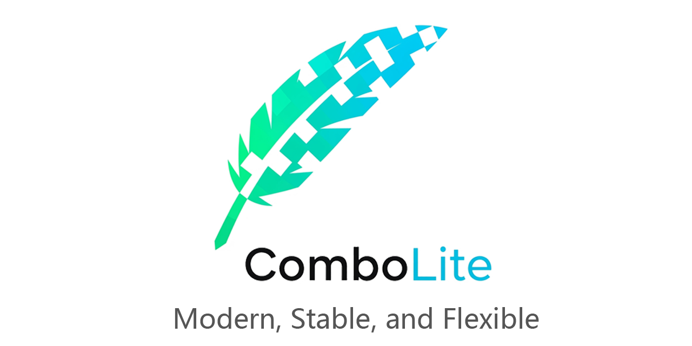
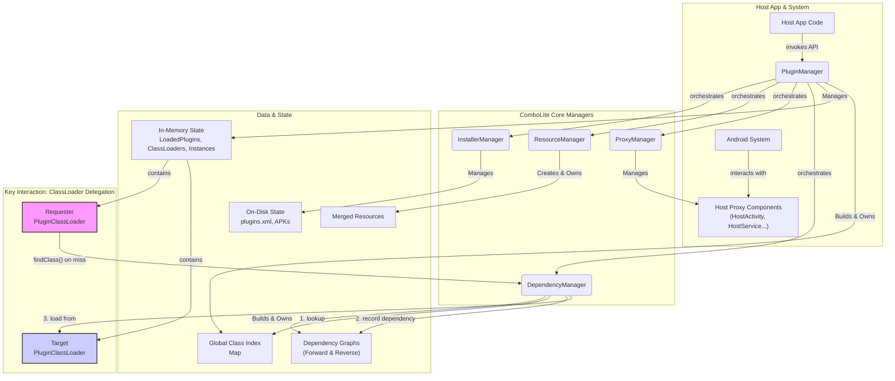

<p align="right">
<a href="./README.md">简体中文</a> | <b>English</b>
</p>

<p align="center">
  
</p>

<p align="center">
<strong>The next-generation Android plugin framework, born for Jetpack Compose, using 100% official APIs with 0 Hooks & 0 Reflection.</strong>
<br />
<em>Modern, stable, and flexible, helping you easily build dynamic applications where "everything is pluggable."</em>
</p>

<p align="center">


<a href="https://kotlinlang.org/"></a>
<a href="https://developer.android.com/jetpack/compose"></a>
<a href="https://developer.android.com/studio/releases/gradle-plugin"></a>
<a href="https://gradle.org/"></a>
<a href="https://github.com/lnzz123/ComboLite/blob/main/LICENSE"></a>
<a href="https://github.com/lnzz123"></a>
</p>

-----

<details>
<summary>📚 <b>Table of Contents</b></summary>

- [🤔 Why Choose ComboLite?](#-why-choose-combolite)
- [✨ Core Features](#-core-features)
- [🚀 Getting Started](#-getting-started)
- [📚 Documentation List](#-what-to-do-next)
- [🆚 Framework Comparison & Technology Selection](#-framework-comparison--technology-selection)
- [🤝 How to Contribute](#-how-to-contribute)
- [❤️ Support & Sponsor](#-support--sponsor)
- [License](#license)

</details>

-----

### 🤔 Why Choose ComboLite?

As the Android ecosystem evolves, plugin frameworks born in the View era are struggling to keep up.
They are often no longer maintained or heavily rely on risky **non-public APIs (Hooks and
Reflection)**. When faced with frequent system updates, they suffer from compatibility issues,
making integration and maintenance costs extremely high.

**`ComboLite` was created to end this predicament.** We return to official standards and embrace
simplicity. Built on a foundation of completely public APIs, we have achieved a pure architecture
with **0 Hooks and 0 Reflection**, fundamentally guaranteeing the framework's ultimate stability and
long-term compatibility.

|          安装启动插件           |          安装启动插件2          |          示例插件页面           |
|:-------------------------:|:-------------------------:|:-------------------------:|
|  |  |  |

|          示例插件页面2          |          去中心化管理           |         崩溃熔断与自愈提示         |
|:-------------------------:|:-------------------------:|:-------------------------:|
|  |  |  |

> 🔗 **Download Sample App
**: [https://github.com/lnzz123/ComboLite/releases](https://github.com/lnzz123/ComboLite/releases)

-----

### ✨ Core Features

#### 🎨 Born for Compose, Embracing the Modern Tech Stack

`ComboLite` is natively designed for the new-generation Android UI toolkit, Jetpack Compose. You can
seamlessly use `@Composable` functions within plugins to build interfaces. The framework also
perfectly integrates modern technologies like Kotlin Coroutines and StateFlow, and uses Koin for
dependency injection, allowing you to enjoy the most cutting-edge and efficient tech stack in your
plugin development.

#### 🛡️ Ultimate Stability: 0 Hooks & 0 Reflection

This is `ComboLite`'s core promise. We are entirely based on the officially recommended
`ClassLoader` and Proxy patterns, without using any non-public APIs. This means the framework has
unparalleled stability and is naturally compatible with all Android versions from 7.0 to future
releases, freeing you from the nightmare of compatibility issues caused by system upgrades.

#### 🚑 Crash Fusing & Self-Healing Mechanism

A powerful built-in `PluginCrashHandler` automatically **disables** a problematic plugin when it
crashes due to issues like missing dependencies. This prevents the application from falling into an
infinite restart loop and guides the user to a friendly error page. This mechanism transforms a
potentially fatal error that could paralyze the app into an isolated, recoverable, and localized
issue, maximizing the stability of the host application.

#### 🔗 Smart Dependency Resolution & Chain Restart

The framework has powerful dynamic dependency resolution capabilities. Dependencies between plugins
do not need to be pre-configured; they are automatically discovered at class-loading time and
dynamically built into a dependency graph. When you need to hot-update a core plugin that other
plugins depend on, `ComboLite`'s **chain restart mechanism** will automatically unload and reload
all affected upstream plugins, perfectly resolving class loader conflicts caused by hot updates and
ensuring absolute consistency of the dependency chain.

#### 🌐 Innovative Decentralized Architecture

We have broken the traditional "Host-Plugin" centralized model. In `ComboLite`, **any plugin has the
ability to manage (download, install, update, uninstall) itself or other plugins**. This gives
developers unprecedented flexibility to easily implement advanced features like a "plugin store," "
on-demand downloads," and "plugin self-updates," building a truly dynamic application ecosystem.

#### 📦 "Shell" Host Support

Thanks to the decentralized architecture, your host app can be a true "empty shell"—containing no
business logic and acting solely as a startup entry point and plugin management container. **All
features and all UI can be dynamically provided by plugins**. This model offers the ultimate
decoupling solution for modularity, dynamization, and team collaboration.

#### ♻️ Transparent, Merged Resource Management

`ComboLite` uses a merged resource management approach. When a plugin is loaded, all its resources (
layouts, drawables, strings, etc.) are dynamically merged into the host's global `Resources` object.
This means you **don't need to care which plugin a resource comes from; you can access all loaded
plugin resources transparently**, just like accessing the host's own resources, greatly simplifying
resource usage in plugins.

#### 🗃️ Service Multi-Instance & Service Pool

`ComboLite` innovatively supports a **service instance pool**. You can use a unique `instanceId` to
launch the same plugin `Service` class as multiple isolated, independently running instances. This
is extremely useful for scenarios that require handling multiple independent tasks simultaneously (
such as download management, multi-stream video, parallel computing) and is an advanced feature that
many other plugin frameworks lack.

#### ⚡️ Lightning-Fast Class Lookup Performance

Traditional plugin frameworks commonly suffer from performance bottlenecks in cross-plugin class
lookups. `ComboLite` achieves **`O(1)` time complexity** for cross-plugin class lookups by creating
a global class index for all plugins upon loading. No matter how large your application or how
complex your plugins, class lookups are completed instantly, ensuring smooth application
performance.

-----

### 🏗️ Architecture Overview

`ComboLite` features a simple yet powerful micro-kernel design, with a few core components working
in concert. The logic is clear and easy to extend.



* **`PluginManager`**: The framework's central coordinator, responsible for plugin loading,
  unloading, restarting, and lifecycle management.
* **`InstallerManager`**: Responsible for the installation, updating, and validation of plugins.
* **`ResourceManager`**: Responsible for loading and managing plugin resources, enabling seamless
  merging of host and plugin resources.
* **`ProxyManager`**: Responsible for proxying Android's four main components and dispatching their
  lifecycles.
* **`DependencyManager`**: Responsible for maintaining the dynamic dependency graph between plugins
  and the global class index.

-----

### 🚀 Getting Started

> The project is currently in its final polishing stage and will be released to Maven Central soon.
> Before then, you can easily integrate it via a local dependency. While this method requires a
> manual
> clone, it also provides great convenience for in-depth understanding and even customization of the
> framework's source code.

#### Step 1: Clone This Project

Clone the `ComboLite` repository to your local machine. It is recommended to place it in the same
parent directory as your own project.

```bash
git clone https://github.com/lnzz123/ComboLite.git
```

#### Step 2: Include the Local Dependency in `settings.gradle.kts`

In your project's root `settings.gradle.kts` file, add the following configuration to allow your
project to find `ComboLite`'s source modules.

```kotlin
// in your project's /settings.gradle.kts
includeBuild("../ComboLite") {
    dependencySubstitution {
        // When you depend on the aar2apk plugin in your project, Gradle will automatically
        // replace it with the local build-logic module.
        substitute(module("com.combo.aar2apk")).using(project(":build-logic"))
    }
}
```

#### Step 3: Add the Plugin and Core Library

Next, configure the dependencies in your project.

① **Apply the `aar2apk` plugin in the root `build.gradle.kts`** (for packaging plugins):

```kotlin
// in your project's root /build.gradle.kts
plugins {
    // ... other plugins
    id("com.combo.aar2apk")
}
```

② **Add the core library to your host app module's `build.gradle.kts`**:

```kotlin
// in your :app/build.gradle.kts
dependencies {
    // ... other dependencies
    implementation(project(":comboLite-core"))
}
```

#### Step 4: Initialize the Framework

Finally, have your `Application` class inherit from `BaseHostApplication` to automatically handle
all initialization work.

```kotlin
// Just inherit from BaseHostApplication
class MainApplication : BaseHostApplication()
```

**Integration complete!** Your project now has the capabilities of the `ComboLite` plugin framework.

-----

### 📚 What to do Next?

With the environment set up, we highly recommend reading the following documents to begin your
plugin development journey:

* **[[Must Read] Quick Start](https://www.google.com/search?q=./docs/1_QUICK_START.md)**: Build and
  run your first plugin from scratch.
* **[[Core] Packaging Guide](https://www.google.com/search?q=./docs/2_PACKAGING_GUIDE.md)**: Dive
  deep into the `aar2apk` plugin and master both packaging strategies.
* **[[Advanced] Core API Usage](https://www.google.com/search?q=./docs/3_CORE_APIS.md)**: Master all
  the core functions of `PluginManager`.
* **[[Advanced] Four Components Guide](https://www.google.com/search?q=./docs/4_COMPONENTS_GUIDE.md)**: Learn how to use Activity, Service, BroadcastReceiver, and ContentProvider within plugins.
* **[[Principles] Architecture & Design](https://www.google.com/search?q=./docs/5_ARCHITECTURE.md)**: Explore the internal workings of ComboLite.

-----

### 🆚 Framework Comparison & Technology Selection

`ComboLite` was designed by drawing on the experience of its predecessors and innovating to address
the pain points of modern Android development.

| Comparison Dimension        | `ComboLite` (This Project)                                                 | `Shadow` (Tencent)                                                      | `RePlugin` (360)                                                     | Classic Hook Schemes (e.g., VirtualAPK)                                       | Google Play Feature Delivery                                            |
|:----------------------------|:---------------------------------------------------------------------------|:------------------------------------------------------------------------|:---------------------------------------------------------------------|:------------------------------------------------------------------------------|:------------------------------------------------------------------------|
| **Core Principle**          | ✅ **Official Public APIs + Proxy Pattern**                                 | Compile-time Code Rewriting + Runtime Delegate                          | ClassLoader Hook + Partial System Hooks                              | ❌ **Heavy Hooking of System Services** (AMS/PMS)                              | ✅ **System-Level Native Support**                                       |
| **System Compatibility**    | 🥇 **Extremely High**, no non-public API calls                             | 🥈 **High**, bypasses most system limits                                | 🥉 **Medium**, ClassLoader modifications are risky on new systems    | 💥 **Low**, sensitive to system versions, easily fails on new systems         | 🥇 **Extremely High**, official solution                                |
| **Jetpack Compose Support** | ✅ **Native Support**, a core design goal                                   | ❌ **Not Supported**                                                     | ❌ **Not Supported**                                                  | ❌ **Not Supported**                                                           | ✅ **Native Support**                                                    |
| **Integration Cost**        | ✨ **Extremely Low**, minimal core code, almost no intrusion                | ⚠️ **High**, relies on a highly custom Gradle plugin                    | ⚠️ **High**, requires understanding its complex lifecycle management | ⚠️ **High**, requires inheriting specific base classes, tedious configuration | ✨ **Extremely Low**, native toolchain support                           |
| **Community Activity**      | 🚀 **Actively Developed**                                                  | ⚠️ **Maintenance Slowed** (since ~2022)                                 | ❌ **Mostly Stagnant** (since ~2020)                                  | ❌ **Stagnant**                                                                | 🚀 **Continuously Iterated by Google**                                  |
| **Main Advantages**         | **Ultimate stability, modern stack, great DX, decentralized architecture** | Ingenious design, good Activity compatibility                           | Comprehensive features, large-scale validation                       | Powerful and complete on specific versions                                    | Stable, reliable, integrated with Google Play ecosystem                 |
| **Main Trade-offs**         | Proxy pattern has limited support for some rare `launchMode`s              | Steep learning curve, black-box build system, incompatible with new AGP | Highly intrusive, compatibility issues increase with system upgrades | **Poor stability, unsuitable for modern development**                         | **Not for hot-updates, requires store release, cannot load local APKs** |

-----

* **Comparison with Hook Schemes (e.g., VirtualAPK / DroidPlugin)**

    * **Them**: They "trick" the system by hooking core services (AMS/PMS). This is powerful but
      extremely unstable. They have largely become obsolete with system iterations and are no longer
      maintained.
    * **Us**: **We never use Hooks**. `ComboLite` uses the officially recommended proxy pattern.
      While it may have slightly less freedom with some extreme Activity launch modes, it gains
      rock-solid stability in return. This is our most important commitment.

* **Comparison with Compile-time Schemes (e.g., Shadow)**

    * **Them**: An ingenious design that avoids hooks by rewriting code at compile time, offering
      higher stability. However, its build system is complex, the learning curve is steep, and the
      project's maintenance has slowed, lagging in support for new tech stacks (like Compose).
    * **Us**: **We embrace simplicity and modernity**. `ComboLite` keeps its core logic clear and
      transparent, staying perfectly in sync with the latest AGP/Gradle/Compose toolchains. This
      allows developers to focus on their business logic, not on the complex framework internals.

* **Comparison with RePlugin (360)**

    * **Them**: Also a classic in the industry, it works by hooking the ClassLoader. However, as new
      Android versions become stricter about non-public APIs, its stability is challenged. The
      project is also largely unmaintained and lacks support for new tech like Compose.
    * **Us**: **We choose a future-proof, stable path**. `ComboLite` completely avoids the
      compatibility risks of hooking and is natively designed for Jetpack Compose, ensuring the best
      development experience and long-term maintainability with a modern tech stack.

* **Comparison with Google Play Feature Delivery**

    * **Them**: This is an **app distribution solution**, designed to reduce the initial install
      size. All module updates must still go through the app store for review and release. It is
      essentially "cold delivery" and cannot achieve true hot-updates.
    * **Us**: **We are a pure hot-update framework**. `ComboLite` gives an app the ability to load
      APKs from any source at runtime, completely bypassing the app store to achieve rapid feature
      iteration, bug fixes, and A/B testing. This is the core value of dynamization.

There is no perfect solution in plugin technology; every choice is a trade-off. `ComboLite`'s design
philosophy is to ensure the ultimate stability and simplicity for **99%** of mainstream scenarios
while carefully handling the **1%** of edge cases.

> **In summary, if you are developing a future-oriented project that uses Jetpack Compose and
prioritizes long-term stability and maintainability, `ComboLite` is your definitive choice.**

-----

### 🤝 How to Contribute

We eagerly welcome contributions of any kind! Whether it's submitting feature suggestions, reporting
bugs, or creating a Pull Request, every bit of help is a huge benefit to the community.

* **Report Bugs or Suggest Features**: Please submit them
  via [GitHub Issues](https://github.com/lnzz123/ComboLite/issues).
* **Contribute Code**: Fork this repository, make your changes, and then open a Pull Request to the
  upstream.

-----

### ❤️ Support & Sponsor

`ComboLite` is a free, open-source project developed and maintained in my spare time. If this
project is helpful to you, your support will be the greatest motivation for my continued dedication.

<details>
<summary>Click to see sponsorship methods</summary>

<br>

<p>Every bit of your support is meaningful. You can buy me a cup of coffee ☕️ through the following methods:</p>

<table>
<tr>
<td align="center">Alipay</td>
<td align="center">WeChat Pay</td>
</tr>
<tr>
<td align="center"></td>
<td align="center"></td>
</tr>
</table>
</details>

-----

### License

`ComboLite` is licensed under
the [Apache-2.0 license](https://github.com/lnzz123/ComboLite/blob/main/LICENSE).

## Star History

[](https://www.star-history.com/#lnzz123/ComboLite&Date)