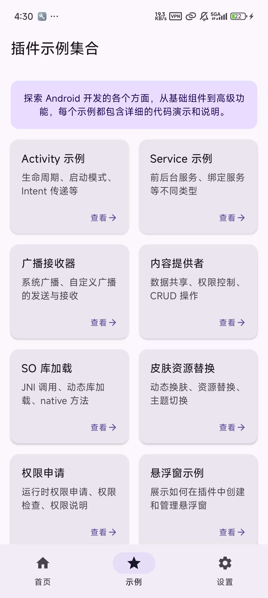
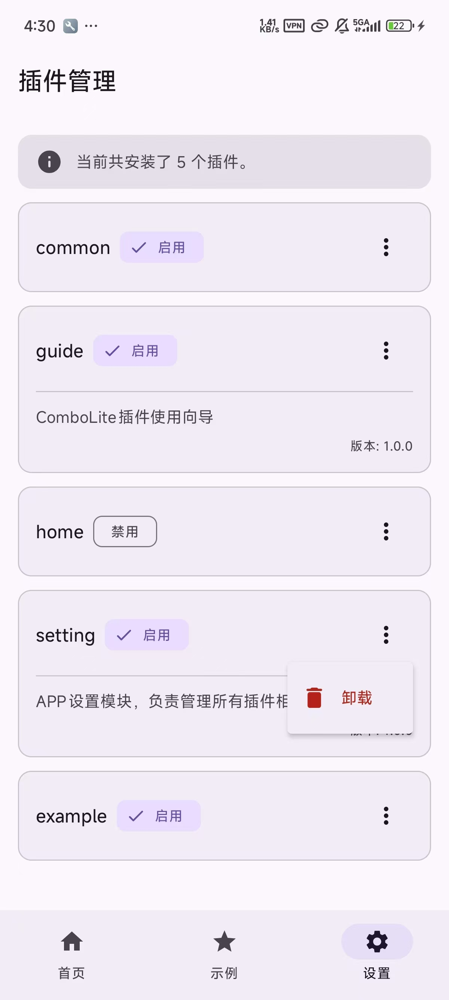

<p align="right">
  <a href="./README.md">简体中文</a> | <b>English</b>
</p>

# ComboLite: The Next-Generation Plugin Framework for Android

<p align="center">
  
  
  <a href="https://kotlinlang.org/"></a>
  <a href="https://developer.android.com/jetpack/compose"></a>
  <a href="https://developer.android.com/studio/releases/gradle-plugin"></a>
  <a href="https://gradle.org/"></a>
  <a href="https://github.com/lnzz123/ComboLite/blob/main/LICENSE"></a>
  <a href="https://github.com/lnzz123"></a>
</p>

🚀 A next-generation Android plugin framework built for Jetpack Compose. A modern, stable, and
flexible plugin solution. **Core Features: Native Compose Support | 100% Official APIs | 0 Hooks & 0
Reflection | Decentralized Architecture**

-----

As the Android ecosystem evolves, many classic plugin frameworks from the View era are struggling to
keep up with modern development demands. Most of these projects are no longer maintained, and their
massive, obscure internal implementations, over-reliance on **non-public APIs (Hooks and reflection)
**, and high integration costs make them increasingly incompatible with frequent system updates.

**`ComboLite` was created to end this dilemma, providing Android developers with a modern, stable,
and flexible plugin framework.**

ComboLite is born for modern Android development. It completely abandons risky non-public API calls
from the ground up, building a pure architecture with **0 Hooks and 0 reflection** based entirely on
public APIs. Its logic is clear and integration is lightweight. It is natively designed for Jetpack
Compose and pioneers a decentralized management philosophy, granting developers unprecedented
flexibility while ensuring ultimate stability.

Whether you want to build a "shell" application where all features are pluggable or add dynamic
capabilities to an existing project, `ComboLite` is your most reliable and modern choice.

## 📸 Screenshots

Download the sample
app: [https://github.com/lnzz123/ComboLite/releases](https://github.com/lnzz123/ComboLite/releases)

|          安装启动插件           |          安装启动插件2          |          示例插件页面           |
|:-------------------------:|:-------------------------:|:-------------------------:|
|  |  |  |

|          示例插件页面2          |          去中心化管理           |         崩溃熔断与自愈提示         |
|:-------------------------:|:-------------------------:|:-------------------------:|
|  |  |  |

## ✨ Core Concepts and Advantages

The design philosophy of `ComboLite` is rooted in four core principles:

#### 1\. Modern by Design

* **Natively for Compose**: `ComboLite` is designed to meet the needs of the next-generation Android
  UI toolkit, Jetpack Compose. Plugins can seamlessly use `@Composable` functions to build
  interfaces, enjoying the development convenience of declarative UI.
* **Embracing the Mainstream Tech Stack**: Perfectly integrates with Kotlin Coroutines and
  StateFlow, and uses Koin for dependency injection, allowing you to use the most advanced and
  efficient technologies in plugin development.
* **Latest Toolchain**: Built on the latest versions of Android Studio, Gradle, and AGP, eliminating
  the integration nightmares caused by outdated frameworks' toolchain incompatibility.

#### 2\. Ultimate Stability & Compatibility

* **0 Hooks, 0 Reflection**: This is ComboLite's core promise. We are entirely based on the official
  Android `ClassLoader` mechanism and use no Hooks. For resource loading, we prioritize the latest
  official APIs and only use the industry-standard, stable reflection solution for compatibility
  with older systems below Android 11. This means the core framework has unparalleled stability and
  natural compatibility with future Android versions.

* **Broad System Support**: Theoretically supports all versions from Android 7.0 (API 24) to Android
  16+, freeing you from concerns about system fragmentation.

* **Intelligent Dependency Resolution & Repair**: The framework has powerful **dynamic dependency
  resolution capabilities**. Dependencies between plugins do not need to be pre-configured; they are
  automatically discovered at class-loading time and dynamically built into a dependency graph. When
  you need to update or restart a core plugin, `ComboLite`'s **chained restart mechanism**
  automatically unloads and reloads all affected upstream plugins, perfectly resolving class loader
  conflicts caused by hot updates and ensuring absolute consistency of the dependency chain.

* **Crash Circuit-Breaking & Self-Healing**: `ComboLite` has a built-in, powerful
  `PluginCrashHandler`. When a plugin causes a `ClassNotFoundException` due to a missing dependency,
  the framework catches this specific `PluginDependencyException` and performs a series of
  self-healing actions:

    * **Precise Localization**: Accurately identifies which plugin caused the crash.
    * **Automatic Circuit-Breaking**: Automatically **disables** the problematic plugin to prevent
      the app from falling into an infinite crash loop on the next launch.
    * **Graceful Degradation**: Guides the user to a friendly error page instead of crashing
      directly, significantly improving the user experience.

  This mechanism transforms a potentially fatal error that could paralyze the entire application
  into an isolatable and recoverable local issue, thus maximizing the stability of the host
  application.

#### 3\. Ultimate Flexibility & Decoupling

* **Decentralized Architecture**: Breaks the traditional "Host-Plugin" strong centralization model.
  Any plugin has the ability to manage (download, install, update, uninstall) itself or other
  plugins, making it easy to implement advanced features like a "Plugin Store" or "On-Demand
  Download."
* **"Shell" Host Support**: The host app can have no business logic and be completely reduced to a
  launch entry point. All features and UI can be provided dynamically by plugins.
* **Flexible Plugin Form**: A standard Android `Application` or `Library` (AAR) project can be
  easily packaged into a standalone plugin, greatly lowering the barrier to plugin development and
  migration.

#### 4\. Excellent Developer Experience

* **Lightweight Core**: The framework's core module contains only a dozen core classes. Besides Koin
  and dexlib2 (for class indexing), it has almost no other third-party dependencies, having a
  minimal impact on the application size.
* **Minimally Intrusive**: Integrating `ComboLite` requires almost no changes to your project's
  existing structure. Your plugin code can be written as naturally as developing a regular app or
  module.
* **Lightning-Fast Class Lookup**: By creating a global class index for all plugins upon loading,
  `ComboLite` achieves `O(1)` time complexity for cross-plugin class lookups, completely eliminating
  the class lookup performance bottlenecks common in traditional plugin frameworks.

## 🏗️ Architecture Overview

`ComboLite` uses a simple and powerful micro-kernel design, with several core components working in
concert.


- **`PluginManager`**: The central coordinator of the framework (singleton), responsible for
  loading, unloading, restarting, and managing the lifecycle of plugins.
- **`InstallerManager`**: Responsible for the installation, updating, and validation of plugins.
- **`ResourceManager`**: Responsible for loading and managing plugin resources, compatible with both
  new and old Android versions.
- **`ProxyManager`**: Responsible for proxying the four major Android components and dispatching
  their lifecycles.
- **`DependencyManager`**: Responsible for maintaining the dynamic dependency graph and class index
  between plugins.

## 🚀 Quick Start

Integrating `ComboLite` is a simple three-step process.

### 1\. Add Dependency

In your host (or shell) application's `build.gradle.kts`, add the core library dependency:

```kotlin
dependencies {
    implementation(projects.pluginFramework.comboLiteCore)
}
```

### 2\. Initialize the Framework

`ComboLite` provides a base class to help you complete a one-step initialization, which is our *
*recommended** approach.

#### Method 1: Inherit from Base Class (Recommended)

Simply have your `Application` class inherit from `com.combo.core.base.BaseHostApplication` to
automatically complete all initialization work, including the plugin loader, resource manager, and
crash handler.

**That's all the initialization code you need\!**

```kotlin
// Just inherit from BaseHostApplication
class MainApplication : BaseHostApplication() {
    override fun onCreate() {
        super.onCreate()
        // Your other application-level initialization logic
    }
}
```

#### Method 2: Manual Initialization (For special scenarios)

If your `Application` cannot inherit from `BaseHostApplication`, you can also initialize it
manually. Please ensure all steps are configured correctly to avoid potential issues.

```kotlin
class MainApplication : Application() {
    override fun onCreate() {
        super.onCreate()

        // 1. (Important) Register the plugin crash handler
        PluginCrashHandler.initialize(this)

        // 2. Initialize the PluginManager
        PluginManager.initialize(this)

        // 3. Asynchronously load enabled plugins
        lifecycleScope.launch {
            val loadedCount = PluginManager.loadEnabledPlugins()
            Log.d("MyApp", "Successfully loaded $loadedCount plugins.")
        }
    }
}
```

### 3\. Create Your First Plugin

A plugin can be an independent `com.android.library` or `com.android.application` module.

#### a. Implement the Plugin Entry

Create a class and implement the `IPluginEntryClass` interface.

```kotlin
class HomePluginEntry : IPluginEntryClass {

    // (Optional) Define Koin dependency injection modules for this plugin
    override val pluginModule: List<Module>
        get() = listOf(
            module {
                viewModel { HomeViewModel() }
                single<IUserService> { UserServiceImpl() }
            }
        )

    // Define the plugin's main UI
    @Composable
    override fun Content() {
        // Your Jetpack Compose screen
        HomeScreen()
    }
}
```

#### b. Declare the Plugin in `AndroidManifest.xml`

In the plugin module's `AndroidManifest.xml`, declare the plugin information using `<meta-data>`
tags.

```xml

<manifest>
    <application>
        <meta-data android:name="plugin.id" android:value="com.example.home" />
        <meta-data android:name="plugin.version" android:value="1.0.0" />
        <meta-data android:name="plugin.entryClass"
            android:value="com.example.home.HomePluginEntry" />
        <meta-data android:name="plugin.description" android:value="Home screen plugin" />

    </application>
</manifest>
```

You're done\! Now you just need to package the plugin into an APK, and you can install and launch it
via the `PluginManager`.

## 📦 Packaging Guide

The `ComboLite` framework is designed with extreme flexibility, supporting two different types of Android modules to be packaged as independently installable and loadable plugins: **`Application` modules** and **`Library` modules**. These two modes each have their own technical principles and optimal use cases. Understanding their differences is crucial for building an efficient and maintainable plugin-based application.

### 1\. Application Modules: Self-Contained Plugins

Packaging a standard `com.android.application` module as a plugin is the most straightforward and simple method. This type of plugin is a fully-featured, self-contained micro-application with all its dependencies included.

#### Packaging Principle

The principle is identical to building a standard Android application. Gradle's `assemble` task bundles all the module's code, resources, and third-party dependencies (included via `implementation`) into the final APK file. After the plugin is loaded, its internal dependencies are isolated from the host and other plugins, loaded by its own `PluginClassLoader`.

#### Configuration Steps

**a. Add Core Dependency**
In the plugin module's `build.gradle.kts`, declare the framework's core library as `compileOnly`. This means the framework code is only used at compile time and will be provided by the host app at runtime, thus avoiding duplicate libraries in the package.

```kotlin
// in your-plugin/build.gradle.kts
dependencies {
    // The core framework library is needed only at compile time and is provided by the host at runtime.
    compileOnly(projects.pluginFramework.comboLiteCore)
    
    // Other internal dependencies of the plugin can be included using implementation as usual.
    implementation("com.google.code.gson:gson:2.9.0")
    // ...
}
```

**b. (Important) Configure Package ID to Prevent Resource Conflicts**
This is a **critical step** to ensure stable plugin operation. When multiple plugins are loaded into the same host, you **must** manually specify a unique `Package ID` for each `Application` plugin module to prevent resource ID conflicts (e.g., two plugins both having a resource named `R.string.app_name`).

The `Package ID` acts as a namespace prefix for the resource IDs (`PP` in `0xPP...`), ensuring that each plugin's resource IDs are globally unique.

```kotlin
// in your-plugin/build.gradle.kts
android {
    // ...
    // Provide additional parameters for the aapt2 tool
    aaptOptions {
        additionalParameters(
            // Specify a unique Package ID, recommended range is 0x80 to 0xFF
            "--package-id", "0x80", 
            // Allow the use of reserved package IDs above 0x7f
            "--allow-reserved-package-id" 
        )
    }
}
```

> **Note**: The `Package ID` for each `Application` plugin must be unique. For example, Plugin A uses `0x80`, Plugin B uses `0x81`, and so on.

**c. Execute Packaging**
You can complete the packaging using the standard tasks provided by the Android Gradle Plugin (AGP).

```bash
# Build the Debug version of the plugin APK
./gradlew :your-plugin-module:assembleDebug

# Build the Release version of the plugin APK
./gradlew :your-plugin-module:assembleRelease
```

#### Pros and Cons

* ✅ **Pros**:
  * **Highly Independent**: The plugin is self-contained with all its dependencies, making deployment simple as it doesn't rely on the host's environment.
  * **No Compatibility Issues**: You don't need to worry about whether the host provides the specific libraries or versions required by the plugin.
  * **Fully-Featured**: Can have complex dependencies and functionality, just like a complete application.
* ⚠️ **Trade-offs**:
  * **Larger Size**: The APK size is relatively large because it includes all dependencies.
  * **Potential Dependency Redundancy**: If multiple plugins use the same library (e.g., `OkHttp`), that library will be bundled into each plugin, increasing the total application size.

-----

### 2\. Library Modules: Lightweight, Shared-Dependency Plugins

Packaging a `com.android.library` module as a plugin is a more advanced and lightweight approach. This type of plugin does not contain any third-party dependencies itself; its operation relies on the shared dependency environment provided by the host app.

#### Packaging Principle

This process is driven by the custom Gradle task `ConvertAarToApkTask` defined in the project's root `build.gradle.kts`. Its core principle is as follows:

1.  **Build AAR**: First, it calls the standard `:your-library-module:assemble` task to build a clean `AAR` file.
2.  **Deconstruct AAR**: The task automatically unpacks this `AAR` file to get its contents, such as `classes.jar`, `res` resources, `AndroidManifest.xml`, etc.
3.  **Compile Resources**: It uses `aapt2` from the Android build toolchain to compile the plugin's resources independently and **automatically assigns a unique `packageId`** based on the configuration (e.g., `0x80`, `0x81`, ...), resolving resource ID conflicts between plugins at the source.
4.  **DEX Conversion**: It uses the `d8` compiler to convert the `classes.jar` from the AAR and the `R.java` files generated after resource compilation into `classes.dex` files, which are executable by the Android runtime.
5.  **Reassemble into APK**: Finally, it repackages the processed `AndroidManifest.xml`, resources, `classes.dex`, and other assets (like `assets`, `jniLibs`), and signs the package with the configured signing key to generate a valid APK that can be loaded by the framework.

#### Configuration Steps

**a. Declare Dependency Scope**
In the Library plugin module's `build.gradle.kts`, **all third-party library dependencies must use the `compileOnly` scope**. This ensures they are only used for compilation and are not packaged into the final artifact.

```kotlin
// in your-library-plugin/build.gradle.kts
dependencies {
    // Core framework library
    compileOnly(projects.pluginFramework.comboLiteCore)
    
    // All third-party dependencies must be compileOnly
    compileOnly("io.coil-kt:coil-compose:2.5.0")
    compileOnly("com.squareup.okhttp3:okhttp:4.12.0")

    // Only internal project module dependencies can use implementation
    // implementation(project(":common-utils")) 
}
```

> **Technical Note: Why is `compileOnly` required?**
> This is not a limitation of the `ComboLite` framework but standard behavior of the Android Gradle Plugin. When building an AAR, AGP's `assemble` task **does not package transitive dependencies**. AARs are designed as development libraries, and their dependencies are intended to be resolved and included by the main application module during the final app build. Manually creating a "Fat AAR" that includes all dependencies is a complex and error-prone process.
>
> `ComboLite` embraces this official design and turns it into an advantage: **by enforcing `compileOnly`, we achieve a clean dependency management model where the host is responsible for providing and managing all common dependencies, while plugins remain extremely lightweight.**

**b. Configure the Packaging Task**
In the project's root `build.gradle.kts` file, add your library module's path to the `pluginModules` list.

```kotlin
// in /build.gradle.kts
// 1. Configure all your plugin module paths here
val pluginModules = listOf(
    ":sample-plugin:common",
    ":sample-plugin:home",
    // ...
    ":your-new-library-plugin" // <-- Add your module here
)
```

**c. One-Click Packaging**
Once configured, you can run the custom Gradle tasks provided by the framework.

```bash
# Package all configured Library plugins in one go (Release version)
./gradlew convertAllToReleasePluginApks

# Package a single plugin (e.g., home)
./gradlew convert_sample-plugin_home_release
```

The packaged APK files will be located in the `build/output/plugin/` directory of the project root.

#### Pros and Cons

* ✅ **Pros**:
  * **Extremely Lightweight**: APK sizes are typically only tens to hundreds of kilobytes, making updates and downloads very cheap.
  * **Eliminates Dependency Conflicts**: All plugins share the same set of dependencies provided by the host, fundamentally avoiding version conflicts.
  * **Unified Dependency Management**: Dependency versions are upgraded and managed centrally by the host, reducing maintenance costs.
  * **Improved Build Speed**: Shared dependencies mean less repetitive compilation.
* ⚠️ **Trade-offs**:
  * **Dependent on Host Environment**: The plugin's operation is highly dependent on the host. If the host fails to provide a dependency required by the plugin at runtime, a `ClassNotFoundException` will occur, breaking the dependency chain. The framework will then automatically trigger its circuit breaker to disable the faulty plugin.
  * **Restricted Dependency Versions**: Plugins must use the dependency versions provided by the host and cannot freely introduce specific versions of libraries internally.

### 3\. How to Choose?

| Scenario                                                             | Recommended Approach   | Reason                                                                                                                |
|:---------------------------------------------------------------------|:-----------------------|:----------------------------------------------------------------------------------------------------------------------|
| **Large, independent feature modules** (e.g., shopping, game center) | **Application Module** | Complex business logic with numerous dependencies requires high cohesion and independence.                            |
| **Plugins for third-party integration**                              | **Application Module** | The host environment is uncontrollable, so dependencies must be self-contained to ensure stability.                   |
| **UI component libraries, utility classes, common services**         | **Library Module**     | Single-purpose, small in size, and ideal for frequent updates and reuse as a shared resource.                         |
| **"Super Apps" with a large number of plugins**                      | **Library Module**     | Maximizes the reuse of common dependencies, significantly reducing the overall application size and memory footprint. |
| **Extreme requirements for plugin update speed and size**            | **Library Module**     | The tiny package size makes dynamic delivery and hot-updates a nearly seamless experience.                            |

By choosing the right packaging strategy, you can fully leverage the advantages of the `ComboLite` framework to build a modern Android application that is both flexible and robust.

## 🔧 Core API Usage

`PluginManager` provides a rich set of APIs to manage and interact with plugins. Here are some of
the most core usage examples.

### 1\. Plugin Management: Install, Uninstall & Enable

Plugin lifecycle management is handled through `PluginManager.installerManager` and `PluginManager`
itself.

```kotlin
// --- Install a plugin ---
// Recommended to run on an IO thread
val pluginApkFile = File("path/to/your/plugin.apk")
val installResult = PluginManager.installerManager.installPlugin(pluginApkFile)

if (installResult is InstallResult.Success) {
    val pluginId = installResult.pluginInfo.pluginId
    println("Plugin [$pluginId] installed successfully!")

    // After successful installation, you can choose to launch it immediately
    PluginManager.launchPlugin(pluginId)
} else {
    println("Plugin installation failed: ${(installResult as InstallResult.Failure).message}")
}


// --- Uninstall a plugin ---
val pluginToUninstall = "com.example.home"
val uninstallSuccess = PluginManager.installerManager.uninstallPlugin(pluginToUninstall)
if (uninstallSuccess) {
    println("Plugin [$pluginToUninstall] uninstalled successfully!")
}

// --- Control plugin auto-start ---
// Prevent a plugin from being loaded automatically on the next app launch
PluginManager.setPluginEnabled("pluginId", false)
```

### 2\. Plugin Execution & Interaction

Launching a plugin and getting its entry instance is fundamental to interacting with its
functionality.

```kotlin
// --- Launch or restart a plugin ---
// If the plugin is not running, it will be started. If it is already running, a chained restart will be performed.
val success = PluginManager.launchPlugin("com.example.home")

// --- Get the plugin entry instance ---
// This allows you to directly call methods or access properties defined in the plugin entry class
val homePlugin: IPluginEntryClass? = PluginManager.getPluginInstance("com.example.home")

// For example, if your host Activity needs to display a plugin's Compose UI
// @Composable
// fun ShowPluginUI(pluginId: String) {
//     val plugin = PluginManager.getPluginInstance(pluginId)
//     plugin?.Content() // Call the plugin's @Composable method
// }
```

### 3\. Accessing Plugin Resources

If needed, you can also directly access the `Resources` object of a specific plugin.

```kotlin
// Get the resource manager for the "com.example.home" plugin
val pluginResources: Resources? = PluginManager.resourcesManager.getResources("com.example.home")

// Use the plugin's resource ID to load resources
val icon = pluginResources?.getDrawable(R.drawable.plugin_icon)
val title = pluginResources?.getString(R.string.plugin_title)
```

For more usage examples, please refer to the sample project's plugin modules.

## 🔧 Usage of the Four Major Components

`ComboLite` provides a series of elegant `Context` extension functions, making calls to plugin
functions as smooth as native ones.

### Activity Usage

Define an Activity in your plugin by inheriting from `BasePluginActivity`.

```kotlin
class HomeActivity : BasePluginActivity() { /* ... */ }
```

Start it from anywhere just like a regular Activity.

```kotlin
context.startPluginActivity(HomeActivity::class.java) {
    putExtra("USER_ID", 123)
}
```

### Service Usage

Define a Service in your plugin by inheriting from `BasePluginService`.

```kotlin
class MusicService : BasePluginService() { /* ... */ }
```

The framework manages plugin Services through a **proxy service pool**. You can start, bind, and
stop them transparently.

```kotlin
context.startPluginService(MusicService::class.java)
context.bindPluginService(MusicService::class.java, serviceConnection, Context.BIND_AUTO_CREATE)
context.stopPluginService(MusicService::class.java)
```

### BroadcastReceiver Usage

Define a Receiver in your plugin by implementing the `IPluginReceiver` interface.

```kotlin
class DownloadReceiver : IPluginReceiver { /* ... */ }
```

Send broadcasts via `sendInternalBroadcast`, and the framework will automatically route them to
registered plugin receivers.

```kotlin
context.sendInternalBroadcast("com.example.DOWNLOAD_COMPLETE") {
    putExtra("FILE_PATH", "/path/to/file")
}
```

### ContentProvider Usage

Define a Provider in your plugin by inheriting from `ContentProvider` just like native development.

```kotlin
class MyPluginProvider : ContentProvider() { /* ... */ }
```

Clients need to access the plugin Provider through a **specially formatted URI**.

```kotlin
// The conventional URI format for accessing a plugin Provider is:
// "content://[Host_Provider_Authority]/[Full_ClassName_of_Plugin_Provider]/[Original_Path]"

val pluginProviderClassName = MyPluginProvider::class.java.name
val hostAuthority =
    "com.jctech.plugin.sample.proxy.provider" // Authority of the host proxy Provider
val originalPath = "items/1"

val proxyUri = Uri.parse("content://$hostAuthority/$pluginProviderClassName/$originalPath")

// Use the proxyUri to perform a query
context.contentResolver.query(proxyUri, null, null, null, null)
```

## 🛠️ Implementation Principles of the Four Major Components

* **Activity**: A single transparent `BaseHostActivity` is registered in the host's`AndroidManifest`
  as a proxy "placeholder". When starting a plugin Activity, the framework launches this proxy
  Activity and passes the real plugin Activity's class name via the `Intent`.`BaseHostActivity` then
  instantiates the plugin Activity internally and binds its lifecycle to its own for dispatching.
* **Service**: An innovative **"proxy service pool"** model is used. You pre-register multiple
  `BaseHostService` instances in the host's `AndroidManifest`. When a plugin Service is started,
  `ProxyManager` finds an available proxy Service from the pool to bind with, associating the plugin
  Service's lifecycle with that proxy. This allows multiple plugin Services to run concurrently and
  independently.
* **BroadcastReceiver**: When a plugin is loaded, the framework parses the static receivers
  registered in its `AndroidManifest.xml` and manages them centrally through `ProxyManager`. When a
  system broadcast arrives, it is received by the proxy `BaseHostReceiver` in the host, which then
  asynchronously dispatches it to all matching plugin `IPluginReceiver`s based on the `Action` and
  other information.
* **ContentProvider**: A single proxy `BaseHostProvider` is pre-registered in the host to serve as
  the sole entry point for all plugin `Provider`s. External access is done through the specially
  formatted `Uri` mentioned above. The proxy `Provider` parses the target plugin `Provider`'s class
  name from the first path segment of the `Uri`, instantiates it, and forwards the request along
  with a rewritten `Uri` that matches the plugin's original `Authority`. The proxy layer is also
  responsible for security checks on the plugin `Provider`'s `exported` status.

## 🆚 Comparison with Other Frameworks

Plugin technology has evolved over many years, giving rise to many excellent open-source projects.
`ComboLite` was designed by drawing upon the experience of its predecessors and innovating to
address the pain points of modern Android development.

We have chosen to compare it with several well-known and representative frameworks in the industry
to help you make a better-informed technical decision.

### Detailed Comparison Table

| Dimension                   | `ComboLite` (Ours)                                   | `Shadow` (Tencent)                                              | `VirtualAPK` / `DroidPlugin`                               |
|:----------------------------|:-----------------------------------------------------|:----------------------------------------------------------------|:-----------------------------------------------------------|
| **Implementation**          | ✅ **Official API + Proxy Pattern**                   | 🌓 **Compile-time Code Rewriting + Runtime Delegate**           | 💥 **Hook System Services (AMS/PMS)**                      |
| **Community Activity**      | 🚀 **Actively Developed** (2025)                     | ⚠️ **Maintenance Slowed** (Last active \~2022)                  | ❌ **Stagnant** (Last active \~2015-2018)                   |
| **Dev Env Compatibility**   | ✅ **Native support for latest AGP/Gradle**           | ❌ **Requires old versions or custom forks**                     | ❌ **Severely incompatible, practically unusable**          |
| **Jetpack Compose**         | ✅ **Native Support, Core Feature**                   | ❌ **Not Supported**                                             | ❌ **Not Supported**                                        |
| **Hot Update Support**      | ✅ **Supported** (UI/Code/Resources)                  | ✅ **Supported** (Activity/Code/Resources)                       | ✅ **Supported**                                            |
| **Four Components Support** | ✅ **Full Support** (Proxy Pattern)                   | ✅ **Good Activity support**, others complex                     | ✅ **Full Support** (Hook Pattern)                          |
| **Framework Complexity**    | ✨ **Very Low** (\~12 core classes)                   | ⚠️ **High** (Requires understanding its build plugin & runtime) | ⚠️ **Extremely High** (Involves many system service hooks) |
| **Integration Difficulty**  | ✨ **Very Low** (A few lines of config)               | ⚠️ **High** (Requires custom build process)                     | ⚠️ **High** (Requires changing base classes & Application) |
| **Intrusiveness**           | ✨ **Minimal**                                        | ⚠️ **High** (Heavy reliance on its Gradle plugin)               | ⚠️ **High** (Requires inheriting specific base classes)    |
| **Architecture Model**      | 🌐 **Decentralized** (Plugins can manage each other) | 🏠 **Centralized** (Host manages plugins)                       | 🏠 **Centralized** (Host manages plugins)                  |
| **DI Support**              | ✅ **Native Koin**                                    | ❌ **Requires custom implementation**                            | ❌ **Requires custom implementation**                       |
| **App Compatibility**       | 🥇 **Excellent** (No reliance on non-public APIs)    | 🥈 **Good** (Bypasses most system restrictions)                 | 🥉 **Poor** (Breaks frequently with system updates)        |

### Analysis of Different Solutions

#### About VirtualAPK / DroidPlugin

These frameworks are **outstanding representatives of the Hook-based approach**. In their time, they
achieved a near-perfect ability to "deceive" the system by hooking core services (
`ActivityManagerService`, `PackageManagerService`, etc.), making them very feature-complete.

* **Pros**: Powerful and supports most native app features on specific system versions.
* **Trade-offs**: Their **fatal flaw** is the strong coupling to the Android system's
  implementation. With rapid Android version iterations and deep customizations by manufacturers,
  these hook points based on non-public APIs are easily broken, leading to severe compatibility and
  stability issues. Today, they are **no longer maintained** and cannot keep up with the modern
  Android development toolchain (like AGP 8.x), making them unsuitable for new projects.

#### About Shadow

`Shadow` is a framework with an **extremely ingenious design**. It takes a different path by
rewriting code at compile time and delegating plugin component calls to a separate "runtime"process,
thereby avoiding direct hooks on system services.

* **Pros**: Excellent Activity compatibility and much higher stability than hook-based solutions.
* **Trade-offs**: `Shadow`'s power comes from its **complex build system**. Developers need to
  deeply rely on its custom Gradle plugin and understand its unique "Host-Runtime-Plugin" model,
  which has a steep learning curve. Additionally, the project's **maintenance has slowed**, and it
  lags in support for the latest Android features and toolchains.

#### About ComboLite (Ours)

`ComboLite` chooses the path of **returning to official standards and embracing simplicity**. We
believe that for the vast majority of business scenarios, stability and maintainability are far more
important than achieving certain edge functionalities through "black magic".

* **Pros**:
    * **Ultimate Stability**: Based entirely on the official public Proxy pattern and `ClassLoader`
      mechanism, without touching any non-public APIs. It naturally has cross-version and
      cross-manufacturer compatibility.
    * **Embracing Modernity**: Natively designed for Jetpack Compose, actively maintained, and
      always keeping up with the latest development toolchains.
    * **Simple and Transparent**: The core framework has very little code, clear logic, and is very
      easy to integrate and extend.
    * **Flexible Architecture**: The unique decentralized design provides more possibilities for
      application architecture.
* **Trade-offs** (Revised Description):
  While the proxy pattern is extremely stable, compared to hook-based solutions that can deeply
  modify system behavior, its freedom is relatively limited in handling complex *
  *Activity `launchMode` and task affinity management**. This is because the proxy Activity's own
  `launchMode` and task behavior are declared in the host's manifest, and plugins cannot completely
  change them dynamically at runtime. `ComboLite`'s choice is to provide the purest and simplest
  solution for 99% of mainstream scenarios, rather than sacrificing the entire framework's
  reliability for 1% of edge cases.

**In summary, if you are developing a future-oriented project that uses a modern tech stack like
Jetpack Compose and prioritizes long-term stability and maintainability, `ComboLite` is your best
choice.**

## How to Contribute

We eagerly welcome contributions of any kind to make `ComboLite` better\! Whether it's submitting
feature suggestions, reporting bugs, creating pull requests, or helping to improve the
documentation, every contribution is a huge help to the community.

* **Report Bugs or Suggest Features**: Please submit them
  through [GitHub Issues](https://github.com/lnzz123/ComboLite/issues). This is the best channel for
  public discussion and tracking issues.
* **Contribute Code**: Please fork this repository, make your changes on your branch, and then
  create a pull request to the upstream. Please ensure your code follows the project's existing
  coding standards.

If you have more complex ideas to discuss or wish to contact us privately (e.g., to report a
security issue), you are also welcome to contact us via email.

📧 **Contact Email**: `1755858138@qq.com`

## ❤️ Support & Sponsor

`ComboLite` is a free, open-source project developed and maintained in my spare time. If this
project is helpful to you, your support would be a great motivation for my continued efforts.

<details>
  <summary>点击查看赞助方式 (Click to see sponsorship methods)</summary>

  <br>

  <p>您的每一份支持都意义非凡。可以通过以下方式请我喝杯咖啡 ☕️：</p>

  <table>
    <tr>
      <td align="center">支付宝 (Alipay)</td>
      <td align="center">微信支付 (WeChat Pay)</td>
    </tr>
    <tr>
      <td align="center"></td>
      <td align="center"></td>
    </tr>
  </table>
</details>

## License

`ComboLite` is licensed under the **Apache-2.0 License**.

This means you are free to:

* **Use commercially**: Use `ComboLite` for free in your commercial products.
* **Distribute**: Freely distribute your application, whether it includes `ComboLite` or not.
* **Modify**: You can modify the source code of `ComboLite` to meet your needs.

You only need to comply with the following simple conditions:

* **Retain notice**: You must retain the original copyright and license notices in your code and
  distribution packages.
* **State changes**: If you modify the source code, you must include a notice in the modified files.

For the full license text, please refer to
the [LICENSE](https://github.com/lnzz123/ComboLite/blob/main/LICENSE) file in the project's root
directory.