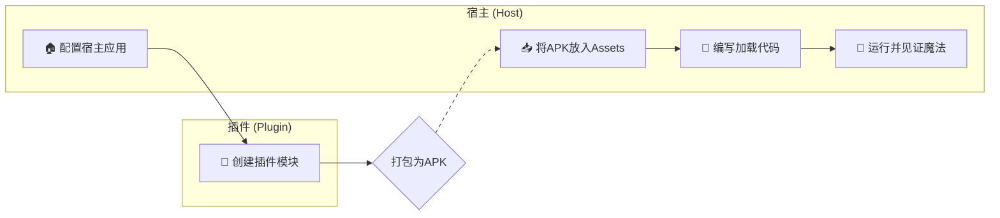

# 快速开始：从零到一运行你的第一个插件

欢迎踏上 `ComboLite` 的探索之旅！本指南将像一位耐心的向导，带你用一杯咖啡的时间，亲手构建并点亮你的第一个动态插件。

我们将引导你完成**宿主配置**、**插件创建**和**插件运行**
的全过程，让你在不涉及复杂打包细节的情况下，快速获得“点亮”第一个插件的成就感。准备好了吗？让我们开始吧！

### 前提条件

在开始之前，我们假定您已经根据主 `README` 的指引，在您的 Android 项目中成功引入了 `ComboLite` 的核心库。

### 整体流程预览

在我们深入细节之前，先通过一个简单的流程图来了解我们将要完成的旅程：



-----

## 第一步：配置宿主应用 (Host App)

宿主是所有插件的“家”，我们需要为它进行一些基础的初始化和配置。

### 1.1 初始化插件化框架

`ComboLite` 的初始化非常灵活，我们提供两种方式：

#### 方式一：全自动初始化（推荐）

这是最省心、最推荐的方式。只需让你的 `Application` 类继承自 `BaseHostApplication`
，框架将自动为你完成所有初始化工作，包括插件加载器、资源管理器以及崩溃处理器。

**这就是全部所需的初始化代码！**

```kotlin
// in :app/src/main/java/your/package/name/MainApplication.kt
import com.combo.core.base.BaseHostApplication

// 只需继承即可，一键完成所有配置
class MainApplication : BaseHostApplication() {
    override fun onCreate() {
        super.onCreate()
        // 你的其他应用级初始化逻辑
    }
}
```

#### 方式二：手动初始化（适用于特殊场景）

如果你的 `Application` 由于项目限制无法继承 `BaseHostApplication`，也可以选择手动进行初始化。请确保所有步骤都正确配置，以避免潜在问题。

```kotlin
// in :app/src/main/java/your/package/name/MainApplication.kt
import android.app.Application
import android.util.Log
import com.combo.core.PluginManager
import com.combo.core.exception.PluginCrashHandler

class MainApplication : Application() {
    override fun onCreate() {
        super.onCreate()

        // 1. (重要) 注册插件崩溃处理器
        PluginCrashHandler.initialize(this)

        // 2. 初始化插件管理器
        PluginManager.initialize(this) {
            // 3. 异步加载已启用的插件
            // 这个代码块会在一个后台线程中执行
            val loadedCount = PluginManager.loadEnabledPlugins()
            Log.d("MyApp", "Successfully loaded $loadedCount plugins.")
            
            // 此代码块执行完毕后，PluginManager 的状态才会更新为初始化成功
        }
    }
}
```

### 1.2 配置宿主 Activity

为了让插件能够正确地访问资源和被代理启动，你的宿主 `Activity` 需要进行配置。

让你的 `MainActivity` (或其他作为宿主的 Activity) 继承自 `BaseHostActivity`。

```kotlin
import com.combo.core.base.BaseHostActivity

class MainActivity : BaseHostActivity() {
    // ...
}
```

> **重要说明**
> `BaseHostActivity` 内部重写了 `getResources()` 和 `getAssets()` 方法，以确保插件能无缝访问宿主和自身的资源。同时，它也包含了代理插件
`Activity` 所需的核心逻辑。
>
> **例外场景**：如果您的项目是一个**纯 Jetpack Compose 的单 Activity 应用**，并且**不需要使用四大组件中的
Activity 插件化功能**，那么您可以**不继承** `BaseHostActivity`。但作为替代，您必须在自己的 Activity
> 中手动重写 `getResources()` 和 `getAssets()` 方法，代码如下：
>
> ```kotlin
> override fun getResources(): Resources {
>     return PluginManager.resourceManager.getMergedResources() ?: super.getResources()
> }
> ```

> override fun getAssets(): AssetManager {
> return PluginManager.resourceManager.getMergedResources()?.assets ?: super.getAssets()
> }
>
> ```
> ```

到这里，宿主端的基础配置就完成了！

> **关于四大组件**
> 如果您需要使用 Service、BroadcastReceiver、ContentProvider 等更高级的插件化功能，还需要在
`Application` 和 `AndroidManifest` 中配置代理和代理池。这些是高级可选功能，我们将在 *
*[[进阶] 四大组件指南](https://www.google.com/search?q=./4_COMPONENTS_GUIDE.md)** 文档中详细讲解。

-----

## 第二步：创建你的第一个插件

现在，让我们来创建一个真正的插件模块。

### 2.1 新建插件模块并添加依赖

在您的项目中，新建一个 Android 模块。它可以是 `application` 类型，也可以是 `library` 类型。

> **我们强烈推荐使用 `library` 模块作为插件。**
> **原因**:
>
>   * **体积更小**: Library 模块默认不包含所有依赖，配合我们的打包插件可以生成极致轻量的 APK。
>   * **依赖解耦**: 插件将依赖宿主提供公共库，避免了依赖冲突，也便于统一管理。

创建完成后，在新建模块的 `build.gradle.kts` 文件中，添加对 `comboLite-core` 的**编译时依赖**：

```kotlin
// in :your-plugin-module/build.gradle.kts
dependencies {
    // 使用 compileOnly，表示此依赖在编译时需要，但打包时由宿主提供
    compileOnly(projects.comboLiteCore)
    // ... 其他依赖
}
```

### 2.2 实现插件入口类 (IPluginEntryClass)

每个插件都需要一个入口类，它实现了 `IPluginEntryClass` 接口，是插件与框架交互的桥梁。这个类包含了插件的生命周期、UI入口和依赖注入配置。

```kotlin
// in your plugin module
package com.example.myplugin

import androidx.compose.material3.Text
import androidx.compose.runtime.Composable
import com.combo.core.data.PluginContext
import com.combo.core.entry.IPluginEntryClass
import org.koin.core.module.Module
import org.koin.dsl.module

class MyPluginEntry : IPluginEntryClass {

    /**
     * 1. (可选) 声明此插件提供的 Koin 依赖注入模块
     * 插件内部的依赖关系可以在这里定义，框架会自动整合。
     */
    override val pluginModule: List<Module>
        get() = listOf(
            module {
                // 例如: single<MyPluginRepository> { MyPluginRepositoryImpl() }
            }
        )
    
    /**
     * 2. 实现 onLoad 生命周期回调
     * 当插件被框架加载后，此方法会被调用。
     * 这是执行所有初始化逻辑的最佳位置。
     */
    override fun onLoad(context: PluginContext) {
        println("插件 [${context.pluginInfo.pluginId}] 已加载，执行初始化...")
        // 在这里进行数据库、网络、全局监听器等的初始化
    }

    /**
     * 3. 实现 onUnload 生命周期回调
     * 当插件被框架卸载前，此方法会被调用。
     * 这是执行所有资源清理工作的最佳位置。
     */
    override fun onUnload() {
        println("插件 [com.example.myplugin] 被卸载，执行资源清理...")
        // 在这里关闭数据库连接、注销监听器等
    }

    /**
     * 4. 实现 Content 方法，提供插件的 UI 入口
     * 这个方法专门用于定义和返回插件的 Jetpack Compose 界面。
     */
    @Composable
    override fun Content() {
        Text("Hello from My First Plugin!")
    }
}
```

### 2.3 在 Manifest 中配置插件元数据

最后，在插件模块的 `AndroidManifest.xml` 文件中，通过 `<meta-data>` 标签告诉框架插件的“身份信息”。

```xml
<manifest xmlns:android="http://schemas.android.com/apk/res/android">
    <application>
        <meta-data android:name="plugin.id" android:value="com.example.myplugin" />
        <meta-data android:name="plugin.version" android:value="1.0.0" />
        <meta-data android:name="plugin.entryClass" android:value="com.example.myplugin.MyPluginEntry" />
        <meta-data android:name="plugin.description" android:value="This is my first plugin." />
    </application>
</manifest>
```

-----

## 第三步：加载并运行插件

### 3.1 准备插件 APK

至此，你的第一个插件已经开发完成！接下来，你需要将这个插件模块打包成一个 APK 文件。打包的具体方法和高级策略，我们将在
**[[核心] 插件打包指南](./2_PACKAGING_GUIDE.md)** 中详细介绍。

**在本指南中，我们假设你已经通过打包插件得到了一个名为 `my-plugin-release.apk` 的文件。**

为了快速验证，我们将这个 APK 文件预置在宿主的 `assets` 目录中进行加载（实际业务场景中，它通常从网络下载）。

1. 在宿主 `:app` 模块的 `src/main` 目录下创建一个 `assets` 文件夹。
2. 将 `my-plugin-release.apk` 复制进去。

> ⚠️ **请务必注意**
>
>   * **文件名完全匹配**: 确保你放入 `assets` 目录的 APK 文件名 (`my-plugin-release.apk`) 与后续
      `MainActivity.kt` 代码中定义的 `pluginApkName` 变量的值**完全一致**。
>   * **插件ID完全匹配**: 确保你的插件 `AndroidManifest.xml` 中声明的 `plugin.id` (
      `com.example.myplugin`) 与后续 `MainActivity.kt` 代码中定义的 `pluginId` 变量的值**完全一致**。
>   * **目录位置正确**: `assets` 文件夹应位于 `:app` 模块的 `src/main/` 目录下，最终路径为
      `app/src/main/assets/`。

### 3.2 编写交互代码（从 Assets 加载）

现在，让我们为宿主 `MainActivity` 添加完整的交互逻辑。

<details>
<summary>👉 点击展开完整的 `MainActivity.kt` 示例代码</summary>

```kotlin
// in :app/src/main/java/your/package/name/MainActivity.kt
import android.os.Bundle
import android.widget.Toast
import androidx.activity.compose.setContent
import androidx.compose.foundation.layout.*
import androidx.compose.material3.*
import androidx.compose.runtime.*
import androidx.compose.ui.Alignment
import androidx.compose.ui.Modifier
import androidx.compose.ui.platform.LocalContext
import androidx.compose.ui.unit.dp
import com.combo.core.PluginManager
import com.combo.core.base.BaseHostActivity
import com.combo.core.data.InstallResult
import com.combo.core.ext.copyFileFromAssets
import kotlinx.coroutines.Dispatchers
import kotlinx.coroutines.launch
import kotlinx.coroutines.withContext
import java.io.File

class MainActivity : BaseHostActivity() {

    // 插件的唯一ID，需要和插件AndroidManifest中声明的保持一致
    private val pluginId = "com.example.myplugin"
    // 放入assets的插件文件名
    private val pluginApkName = "my-plugin-release.apk"

    override fun onCreate(savedInstanceState: Bundle?) {
        super.onCreate(savedInstanceState)
        setContent {
            var pluginUi by remember { mutableStateOf<(@Composable () -> Unit)?>(null) }
            val coroutineScope = rememberCoroutineScope()
            val context = LocalContext.current

            MaterialTheme {
                Column(
                    modifier = Modifier.fillMaxSize().padding(16.dp),
                    horizontalAlignment = Alignment.CenterHorizontally,
                    verticalArrangement = Arrangement.Center
                ) {
                    Text("宿主应用", style = MaterialTheme.typography.headlineMedium)
                    Spacer(modifier = Modifier.height(32.dp))

                    // 插件UI的显示区域
                    Surface(
                        modifier = Modifier.fillMaxWidth().height(200.dp),
                        tonalElevation = 2.dp,
                        shape = MaterialTheme.shapes.medium
                    ) {
                        Box(modifier = Modifier.fillMaxSize(), contentAlignment = Alignment.Center) {
                            if (pluginUi != null) {
                                pluginUi?.invoke()
                            } else {
                                Text("插件UI将显示在这里")
                            }
                        }
                    }

                    Spacer(modifier = Modifier.height(32.dp))

                    // 1. 安装插件按钮
                    Button(onClick = {
                        // 使用IO调度器处理文件操作，避免阻塞主线程
                        coroutineScope.launch(Dispatchers.IO) {
                            try {
                                // 将插件APK从assets复制到应用私有目录，这是安装插件的前置步骤
                                val pluginFile = File(context.filesDir, pluginApkName)
                                context.copyFileFromAssets(pluginApkName, pluginFile)
                                
                                // 调用核心API安装插件
                                val result = PluginManager.installerManager.installPlugin(pluginFile)
                                
                                // 操作完成后，切回主线程更新UI或显示提示
                                withContext(Dispatchers.Main) {
                                    when (result) {
                                        is InstallResult.Success -> {
                                            Toast.makeText(context, "插件 [${result.pluginInfo.pluginId}] 安装成功!", Toast.LENGTH_SHORT).show()
                                        }
                                        is InstallResult.Failure -> {
                                            Toast.makeText(context, "插件安装失败: ${result.message}", Toast.LENGTH_LONG).show()
                                        }
                                    }
                                }
                            } catch (e: Exception) {
                                withContext(Dispatchers.Main) {
                                    Toast.makeText(context, "操作失败: ${e.message}", Toast.LENGTH_LONG).show()
                                }
                            }
                        }
                    }) {
                        Text("1. 从 Assets 安装插件")
                    }

                    Spacer(modifier = Modifier.height(10.dp))
                    
                    // 2. 启动插件并显示UI按钮
                    Button(onClick = {
                        coroutineScope.launch {
                           // 启动插件 (如果已启动，会执行链式重启，确保总是最新状态)
                           PluginManager.launchPlugin(pluginId)
                           
                           // 获取插件实例，并将其@Composable Content()方法赋值给UI状态
                           val pluginInstance = PluginManager.getPluginInstance(pluginId)
                           if (pluginInstance != null) {
                               pluginUi = { pluginInstance.Content() }
                               Toast.makeText(context, "插件 [${pluginId}] 启动成功!", Toast.LENGTH_SHORT).show()
                           } else {
                               Toast.makeText(context, "插件 [${pluginId}] 未找到或加载失败", Toast.LENGTH_LONG).show()
                           }
                        }
                    }) {
                        Text("2. 启动并显示插件")
                    }
                }
            }
        }
    }
}
```

</details>

### 3.3 运行并验证

现在，运行你的宿主 App，并按照界面上的按钮顺序操作：

1. 点击 **“1. 从 Assets 安装插件”** 按钮。应用会从 `assets` 中读取 APK 并完成安装。你会看到一个 "
   安装成功" 的 Toast 提示。
2. 点击 **“2. 启动并显示插件”** 按钮。框架会加载插件，然后界面上会显示出 **“Hello from My First
   Plugin!”** 的字样。

当你完成所有步骤并点击按钮后，你的应用界面应如下所示：

*(请将此路径替换为您的实际截图路径)*

## 恭喜！与后续步骤

太棒了！你已经成功地跨出了最重要的一步，完成了 `ComboLite` 插件化开发的完整闭环。这不仅仅是一个 "Hello
World"，更是你开启现代化、动态化 App 构建大门的钥匙。我们为你感到骄傲！

如果你在学习过程中遇到任何问题，可以随时参考我们为您准备的、可直接运行的快速入门示例代码

现在你已经掌握了基础，是时候深入探索 `ComboLite` 的更多强大功能了：

* **[[核心] 插件打包指南](https://www.google.com/search?q=./2_PACKAGING_GUIDE.md)**:
  学习如何将你的插件模块真正打包成 APK。
* **[[进阶] 核心 API 用法](https://www.google.com/search?q=./3_CORE_APIS.md)**: 掌握 `PluginManager`
  提供的丰富接口。
* **[[进阶] 四大组件指南](https://www.google.com/search?q=./4_COMPONENTS_GUIDE.md)**: 让你的插件拥有
  Activity、Service 等能力。
* **[[原理] 架构与设计](https://www.google.com/search?q=./5_ARCHITECTURE.md)**: 深入了解 `ComboLite`
  的工作魔法。