# Quick Start: Build and Run Your First Plugin from Scratch

Welcome to your exploration of `ComboLite`! This guide will serve as your patient mentor, walking
you through the entire process of building and launching your first dynamic plugin in the time it
takes to drink a cup of coffee.

We will guide you through **host configuration**, **plugin creation**, and **plugin execution**. You
will experience the satisfaction of "lighting up" your first plugin without getting bogged down in
complex packaging details. Are you ready? Let's get started!

### Prerequisites

Before we begin, please ensure you have met the following conditions:

* You have successfully integrated the `ComboLite` core library into your Android project according
  to the main `README`'s instructions.

### Overall Process Preview

Before diving into the details, let's look at a simple flowchart to understand the journey we are
about to take:

```mermaid
graph LR
    A[🏠 Configure Host App] --> B[🧩 Create Plugin Module];
    B --> C{Package into APK};
    C --> D[📥 Place APK in Assets];
    D --> E[🚀 Write Loading Code];
    E --> F[🎉 Run & Witness the Magic];

    subgraph "Host"
        A
        D
        E
        F
    end

    subgraph "Plugin"
        B
    end
    
    linkStyle 2 stroke-dasharray: 5 5;
```



-----

## Step 1: Configure the Host App

The host is the "home" for all plugins. We need to perform some basic initialization and
configuration for it.

### 1.1 Initialize the Plugin Framework

`ComboLite`'s initialization is very flexible, offering two methods:

#### Method 1: Fully Automatic Initialization (Recommended)

This is the easiest and most recommended approach. Simply have your `Application` class inherit from
`BaseHostApplication`, and the framework will automatically handle all initialization tasks for you,
including the plugin loader, resource manager, and crash handler.

**This is all the initialization code you need!**

```kotlin
// in :app/src/main/java/your/package/name/MainApplication.kt
import com.combo.core.base.BaseHostApplication

// Just inherit, and all configuration is done with one click
class MainApplication : BaseHostApplication() {
    override fun onCreate() {
        super.onCreate()
        // Your other application-level initialization logic
    }
}
```

#### Method 2: Manual Initialization (For Special Cases)

If your `Application` class cannot inherit from `BaseHostApplication` due to project constraints,
you can opt for manual initialization. Please ensure all steps are configured correctly to avoid
potential issues.

```kotlin
// in :app/src/main/java/your/package/name/MainApplication.kt
import android.app.Application
import android.util.Log
import com.combo.core.PluginManager
import com.combo.core.exception.PluginCrashHandler

class MainApplication : Application() {
    override fun onCreate() {
        super.onCreate()

        // 1. (Important) Register the plugin crash handler
        PluginCrashHandler.initialize(this)

        // 2. Initialize the PluginManager
        PluginManager.initialize(this) {
            // 3. Asynchronously load enabled plugins
            // This block executes on a background thread
            val loadedCount = PluginManager.loadEnabledPlugins()
            Log.d("MyApp", "Successfully loaded $loadedCount plugins.")

            // The PluginManager's state is updated to initialized only after this block completes
        }
    }
}
```

### 1.2 Configure the Host Activity

To ensure that plugins can correctly access resources and be launched via proxy, your host`Activity`
needs to be configured.

Have your `MainActivity` (or any other host Activity) inherit from `BaseHostActivity`.

```kotlin
import com.combo.core.base.BaseHostActivity

class MainActivity : BaseHostActivity() {
    // ...
}
```

> **Important Note**
> `BaseHostActivity` internally overrides `getResources()` and `getAssets()` to ensure seamless
> resource access for both the host and plugins. It also contains the core logic for proxying plugin
`Activity` instances.
>
> **Exception Scenario**: If your project is a **pure Jetpack Compose single-Activity application**
> and you **do not need the plugin functionality for the four major components (specifically
> Activity)
**, you can choose **not to inherit** from `BaseHostActivity`. As an alternative, you must manually
> override the `getResources()` and `getAssets()` methods in your own Activity as follows:
>
> ```kotlin
> override fun getResources(): Resources {
>     return PluginManager.resourceManager.getMergedResources() ?: super.getResources()
> }
> ```

> override fun getAssets(): AssetManager {
> return PluginManager.resourceManager.getMergedResources()?.assets ?: super.getAssets()
> }
>
> ```
> ```

At this point, the basic configuration for the host is complete!

> **About the Four Major Components**
> If you need to use more advanced plugin features like Service, BroadcastReceiver, or
> ContentProvider, you will need to configure proxies and a proxy pool in your `Application` and
`AndroidManifest`. These are advanced, optional features that will be detailed in the *
*[[Advanced] Four Components Guide](./4_COMPONENTS_GUIDE_en.md)**.

-----

## Step 2: Create Your First Plugin

Now, let's create a real plugin module.

### 2.1 Create a New Module and Add Dependencies

In your project, create a new Android module. It can be of type `application` or `library`.

> **We highly recommend using a `library` module for your plugins.**
> **Reasons**:
>
>   * **Smaller Size**: Library modules do not include all dependencies by default, which, when
      combined with our packaging plugin, can produce extremely lightweight APKs.
>   * **Dependency Decoupling**: Plugins will rely on the host to provide common libraries, which
      avoids dependency conflicts and simplifies overall management.

After creating the module, add a **compile-time dependency** on `comboLite-core` in the new module's
`build.gradle.kts` file:

```kotlin
// in :your-plugin-module/build.gradle.kts
dependencies {
    // Use compileOnly to indicate that this dependency is needed at compile time
    // but will be provided by the host at runtime.
    compileOnly(projects.comboLiteCore)
    // ... other dependencies
}
```

### 2.2 Implement the Plugin Entry Class (IPluginEntryClass)

Each plugin requires an entry class that implements the `IPluginEntryClass` interface, serving as
the bridge between the plugin and the framework. This class contains the plugin's lifecycle
callbacks, UI entry point, and dependency injection configuration.

```kotlin
// in your plugin module
package com.example.myplugin

import androidx.compose.material3.Text
import androidx.compose.runtime.Composable
import com.combo.core.data.PluginContext
import com.combo.core.entry.IPluginEntryClass
import org.koin.core.module.Module
import org.koin.dsl.module

class MyPluginEntry : IPluginEntryClass {

    /**
     * 1. (Optional) Declare Koin dependency injection modules provided by this plugin.
     * Internal dependencies of the plugin can be defined here, and the framework will integrate them automatically.
     */
    override val pluginModule: List<Module>
        get() = listOf(
            module {
                // e.g., single<MyPluginRepository> { MyPluginRepositoryImpl() }
            }
        )

    /**
     * 2. Implement the onLoad lifecycle callback.
     * This method is called after the plugin is loaded by the framework.
     * It is the best place to perform all initialization logic.
     */
    override fun onLoad(context: PluginContext) {
        println("Plugin [${context.pluginInfo.pluginId}] has been loaded, initializing...")
        // Initialize database, network, global listeners, etc., here.
    }

    /**
     * 3. Implement the onUnload lifecycle callback.
     * This method is called before the plugin is unloaded by the framework.
     * It is the best place to perform all resource cleanup tasks.
     */
    override fun onUnload() {
        println("Plugin [com.example.myplugin] is being unloaded, cleaning up resources...")
        // Close database connections, unregister listeners, etc., here.
    }

    /**
     * 4. Implement the Content method to provide the plugin's UI entry point.
     * This method is specifically for defining and returning the plugin's Jetpack Compose UI.
     */
    @Composable
    override fun Content() {
        Text("Hello from My First Plugin!")
    }
}
```

### 2.3 Configure Plugin Metadata in the Manifest

Finally, in the plugin module's `AndroidManifest.xml` file, use `<meta-data>` tags to provide the
framework with the plugin's "identity information."

```xml

<manifest xmlns:android="http://schemas.android.com/apk/res/android">
    <application>
        <meta-data android:name="plugin.id" android:value="com.example.myplugin" />
        <meta-data android:name="plugin.version" android:value="1.0.0" />
        <meta-data android:name="plugin.entryClass"
            android:value="com.example.myplugin.MyPluginEntry" />
        <meta-data android:name="plugin.description" android:value="This is my first plugin." />
    </application>
</manifest>
```

-----

## Step 3: Load and Run the Plugin

### 3.1 Prepare the Plugin APK

At this point, your first plugin is fully developed! Next, you need to package this module into an
APK file. The specific methods and advanced strategies for packaging will be detailed in the *
*[[Core] Packaging Guide](https://www.google.com/search?q=./2_PACKAGING_GUIDE.md)**.

**For this guide, we will assume you have already obtained a file named `my-plugin-release.apk` by
packaging the plugin.**

For quick verification, we will preload this APK file in the host's `assets/plugins` directory for loading (
in a real-world scenario, it would typically be downloaded from a network).

1. Create an `assets/plugins` folder in your host's `:app` module, under the `src/main` directory.
2. Copy `my-plugin-release.apk` into it.

> ⚠️ **Please Pay Close Attention**
>
>   * **Exact Filename Match**: Ensure the APK filename in the `assets/plugins` directory (
      `my-plugin-release.apk`) is **identical** to the value of the `pluginApkName` variable defined
      in your `MainActivity.kt` code.
>   * **Exact Plugin ID Match**: Ensure the `plugin.id` declared in your plugin's
      `AndroidManifest.xml` (`com.example.myplugin`) is **identical** to the value of the `pluginId`
      variable defined in your `MainActivity.kt`.
>   * **Correct Directory Location**: The `assets/plugins` folder should be located in your `:app` module's
      `src/main/` directory, with the final path being `app/src/main/assets/plugins/`.

### 3.2 Write the Interaction Code (Loading from Assets)

Now, let's add the complete interaction logic to the host `MainActivity`.

<details>
<summary>👉 Click to expand the complete `MainActivity.kt` example code</summary>

```kotlin
package com.combo.plugin.sample

import android.os.Bundle
import androidx.activity.compose.setContent
import androidx.activity.enableEdgeToEdge
import androidx.compose.runtime.collectAsState
import androidx.compose.runtime.getValue
import androidx.compose.runtime.key
import com.combo.core.base.BaseHostActivity
import com.combo.core.manager.PluginManager

class HostActivity : BaseHostActivity() {
    override fun onCreate(savedInstanceState: Bundle?) {
        super.onCreate(savedInstanceState)
        if (super.pluginActivity == null) {
            enableEdgeToEdge()
            setContent {
                val resources by PluginManager.resourcesManager.mResourcesFlow.collectAsState()
                key(resources) {
                    LoadingScreen()
                }
            }
        }
    }
}
```

```kotlin
package com.combo.plugin.sample

import androidx.compose.foundation.layout.Arrangement
import androidx.compose.foundation.layout.Box
import androidx.compose.foundation.layout.Column
import androidx.compose.foundation.layout.fillMaxSize
import androidx.compose.foundation.layout.padding
import androidx.compose.foundation.layout.size
import androidx.compose.material3.Button
import androidx.compose.material3.CircularProgressIndicator
import androidx.compose.material3.MaterialTheme
import androidx.compose.material3.Surface
import androidx.compose.material3.Text
import androidx.compose.runtime.Composable
import androidx.compose.runtime.collectAsState
import androidx.compose.runtime.getValue
import androidx.compose.ui.Alignment
import androidx.compose.ui.Modifier
import androidx.compose.ui.text.style.TextAlign
import androidx.compose.ui.unit.dp
import com.combo.plugin.sample.LoadingViewModel.Companion.PLUGIN_ID
import org.koin.androidx.compose.koinViewModel

/**
 * 加载页面
 *
 * 在插件框架初始化期间显示的加载界面
 */
@Composable
fun LoadingScreen(viewModel: LoadingViewModel = koinViewModel()) {
    val loading by viewModel.loading.collectAsState()
    val entryClass by viewModel.entryClass.collectAsState()
    Surface(
        modifier = Modifier.fillMaxSize(),
        color = MaterialTheme.colorScheme.background,
    ) {
        Box(
            modifier = Modifier.fillMaxSize(),
            contentAlignment = Alignment.Center,
        ) {
            if (loading) {
                Column(
                    horizontalAlignment = Alignment.CenterHorizontally,
                    verticalArrangement = Arrangement.spacedBy(16.dp),
                ) {
                    CircularProgressIndicator(
                        modifier = Modifier.size(48.dp),
                        color = MaterialTheme.colorScheme.primary,
                    )

                    Text(
                        text = "正在初始化插件框架...",
                        style = MaterialTheme.typography.bodyLarge,
                        color = MaterialTheme.colorScheme.onBackground,
                        textAlign = TextAlign.Center,
                        modifier = Modifier.padding(horizontal = 32.dp),
                    )
                }
            } else if (entryClass == null) {
                val pluginState = viewModel.getPluginStatus(PLUGIN_ID)
                Column(
                    horizontalAlignment = Alignment.CenterHorizontally,
                    verticalArrangement = Arrangement.spacedBy(16.dp),
                ) {
                    Text(
                        text = "基础插件${
                            when(pluginState) {
                                PluginStatus.NOT_INSTALLED -> "未安装"
                                PluginStatus.INSTALLED_NOT_STARTED -> "已安装但未启动"
                                else -> "已安装且已启动"
                            }
                        }",
                        style = MaterialTheme.typography.bodyLarge,
                        color = MaterialTheme.colorScheme.onBackground,
                        textAlign = TextAlign.Center,
                        modifier = Modifier.padding(horizontal = 32.dp),
                    )
                    Button(
                        onClick = {
                            when(pluginState) {
                                PluginStatus.NOT_INSTALLED -> {
                                    viewModel.installPlugin(LoadingViewModel.BASE_PATH, true)
                                }

                                PluginStatus.INSTALLED_NOT_STARTED -> {
                                    viewModel.launchBasePlugin()
                                }

                                else -> {
                                    viewModel.launchBasePlugin()
                                }
                            }
                        },
                    ) {
                        Text(
                            text = when(pluginState) {
                                PluginStatus.NOT_INSTALLED -> "安装插件"
                                PluginStatus.INSTALLED_NOT_STARTED -> "启动插件"
                                else -> "打开应用"
                            }
                        )
                    }
                }
            } else {
                entryClass?.Content()
            }
        }
    }
}
```

```kotlin
package com.combo.plugin.sample

import android.annotation.SuppressLint
import android.content.Context
import androidx.lifecycle.ViewModel
import androidx.lifecycle.viewModelScope
import com.combo.core.interfaces.IPluginEntryClass
import com.combo.core.manager.PluginManager
import kotlinx.coroutines.flow.MutableStateFlow
import kotlinx.coroutines.flow.StateFlow
import kotlinx.coroutines.flow.asStateFlow
import kotlinx.coroutines.launch
import java.io.File
import java.io.FileOutputStream

/**
 * 插件状态枚举
 */
enum class PluginStatus {
    /** 插件未安装 */
    NOT_INSTALLED,

    /** 插件已安装但未启动 */
    INSTALLED_NOT_STARTED,

    /** 插件已安装且已启动 */
    INSTALLED_AND_STARTED,
}


class LoadingViewModel(
    context: Context,
) : ViewModel() {
    @SuppressLint("StaticFieldLeak")
    private val context = context.applicationContext

    private val _loading = MutableStateFlow(false)
    val loading: StateFlow<Boolean> = _loading.asStateFlow()

    private val _entryClass = MutableStateFlow<IPluginEntryClass?>(null)
    val entryClass: StateFlow<IPluginEntryClass?> = _entryClass.asStateFlow()

    companion object {
        const val BASE_PATH = "plugins"
        const val PLUGIN_ID = "com.example.myplugin"
    }

    init {
        init()
    }

    fun init() {
        viewModelScope.launch {
            setLoading(true)
            if (getPluginStatus(PLUGIN_ID) == PluginStatus.NOT_INSTALLED) {
                installPlugin(BASE_PATH)
            } else {
                PluginManager.loadEnabledPlugins()
            }
            _entryClass.value = PluginManager.getPluginInstance(PLUGIN_ID)
            setLoading(false)
        }
    }

    fun setLoading(isLoading: Boolean) {
        _loading.value = isLoading
    }

    fun installPlugin(
        assetPath: String,
        forceOverwrite: Boolean = false,
    ) {
        viewModelScope.launch {
            setLoading(true)
            val pluginFiles = context.assets.list(assetPath)
            pluginFiles?.forEach { fileName ->
                val pluginFile = File(context.filesDir, fileName)
                context.assets.open("$assetPath/$fileName").use { inputStream ->
                    FileOutputStream(pluginFile).use { outputStream ->
                        inputStream.copyTo(outputStream)
                    }
                }
                PluginManager.installerManager.installPlugin(pluginFile, forceOverwrite)
            }
            PluginManager.loadEnabledPlugins()
            _entryClass.value = PluginManager.getPluginInstance(PLUGIN_ID)
            setLoading(false)
        }
    }

    fun launchBasePlugin() {
        viewModelScope.launch {
            PluginManager.launchPlugin(PLUGIN_COMMON).let {
                if (it) {
                    PluginManager.getPluginInstance(PLUGIN_COMMON)
                }
            }
            PluginManager.launchPlugin(PLUGIN_ID).let {
                if (it) {
                    _entryClass.value = PluginManager.getPluginInstance(PLUGIN_ID)
                }
            }
        }
    }

    /**
     * 获取指定插件的状态
     *
     * @param pluginId 插件ID
     * @return 插件状态枚举
     */
    fun getPluginStatus(pluginId: String): PluginStatus {
        // 检查插件是否已安装
        val isInstalled = PluginManager.getAllInstallPlugins().any { it.pluginId == pluginId }

        if (!isInstalled) {
            return PluginStatus.NOT_INSTALLED
        }

        val entryClass = PluginManager.getPluginInstance(pluginId)

        return if (entryClass != null) {
            PluginStatus.INSTALLED_AND_STARTED
        } else {
            PluginStatus.INSTALLED_NOT_STARTED
        }
    }
}

```

</details>

### 3.3 Run and Verify

Now, run your host app and follow the on-screen button order:

1. Click the **"1. Install Plugin from Assets"** button. The app will read the APK from `assets` and
   complete the installation. You will see a "installed successfully" Toast message.
2. Click the **"2. Launch and Display Plugin"** button. The framework will load the plugin, and the
   text **"Hello from My First Plugin!"** will appear on the screen.

After completing all the steps and clicking the buttons, your app interface should look like this:

*(Please replace this path with your actual screenshot path)*

## Congratulations! & Next Steps

Fantastic! You have successfully completed the entire loop of `ComboLite`'s plugin development. This
is more than just a "Hello World"; it's the key to unlocking the door to modern, dynamic app
construction. We are proud of you!

If you encounter any issues during this process, you can always refer to the complete, runnable
quick-start sample code we have prepared for you.

Now that you've mastered the basics, it's time to dive deeper into `ComboLite`'s more powerful
features:

* **[[Core] Packaging Guide](./2_PACKAGING_GUIDE_en.md)**: Learn how to properly package your plugin
  modules into APKs.
* **[[Advanced] Core API Usage](./3_CORE_APIS_en.md)**: Master the rich interface provided by
  `PluginManager`.
* **[[Advanced] Four Components Guide](./4_COMPONENTS_GUIDE_en.md)**: Give your plugins the power of
  Activity, Service, and more.
* **[[Principles] Architecture & Design](./5_ARCHITECTURE_en.md)**: Delve into the magic behind how
  `ComboLite` works.