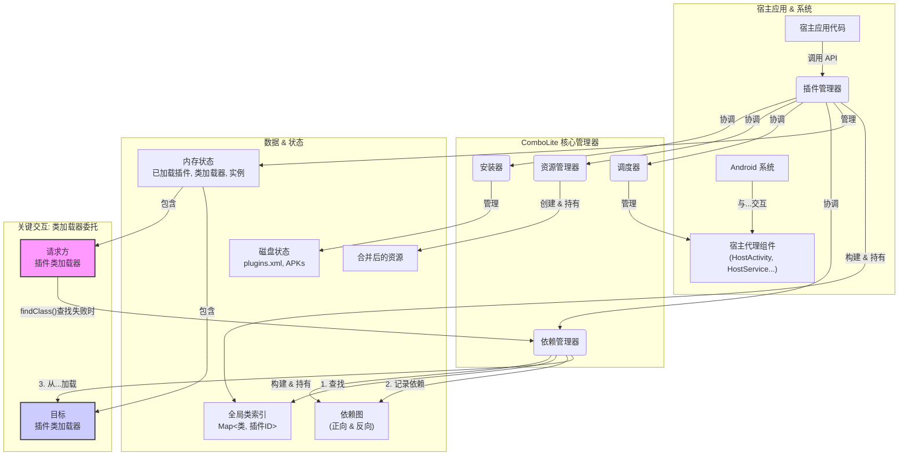

# 架构与设计原理

欢迎深入 `ComboLite` 的内核！

本篇文档旨在揭示 `ComboLite` 的内部工作机制和核心设计理念。通过理解框架的底层原理，你将能更好地利用其特性，并在遇到问题时进行更高效的诊断。

`ComboLite` 的设计哲学根植于三大基石：

* **极致稳定 (Stability)**：彻底抛弃非公开 API (Hook & 反射)，100% 使用官方推荐的机制，确保框架的长期兼容性和可靠性。
* **拥抱现代 (Modernity)**：原生为 Jetpack Compose 和 Kotlin Coroutines 设计，与最新的 Android
  开发工具链保持同步。
* **简单透明 (Simplicity)**：保持核心逻辑的简洁与清晰，降低开发者的理解和二次开发成本。

---

## 一、宏观架构 (High-Level Architecture)

`ComboLite` 采用简洁而强大的微核设计，由几个各司其职的核心管理器协同工作。

* **`PluginManager` (总控制器)**: 框架的最高指挥官和唯一的单例入口。它负责协调其他所有管理器，并掌管所有插件的
  **运行时状态**（加载、实例化、卸载）。
* **`InstallerManager` (安装器)**: 插件的“物理世界”管理员。负责插件的安装、更新、卸载流程，管理插件 APK
  在磁盘上的存储，并维护所有已安装插件的元数据清单 (`plugins.xml`)。
* **`ResourceManager` (资源管理器)**: 插件的“视觉”引擎。它通过合并所有已加载插件的资源，提供一个统一的
  `Resources` 对象，让宿主和插件可以透明地访问任何资源。
* **`ProxyManager` (调度器)**: 四大组件的“生命周期代理人”。它负责管理宿主端的代理组件（如
  `HostActivity`、`HostService` 池），并将 Android 系统的意图（Intent）正确地分发给对应的插件组件。
* **`DependencyManager` (依赖管理器)**:
  插件间的“关系图谱”。它在插件加载时动态分析插件间的依赖关系，构建出一个有向图，为“链式重启”和跨插件类查找提供数据支持。

-----

## 二、核心工作流：一个插件的生命之旅

让我们跟随一个插件，从一个 APK 文件开始，走完它在 `ComboLite` 中的完整生命周期。

#### 1\. 安装 (Installation)

当你调用 `PluginManager.installerManager.installPlugin(apkFile)` 时：

1. **安全检查**: `InstallerManager` 首先会校验 `apkFile` 的**数字签名**是否与宿主 App 一致。
2. **元数据解析**: 接着，它会解析 APK 的 `AndroidManifest.xml`，提取出 `plugin.id`、`plugin.version`
   等核心元数据，并进行合法性校验。
3. **版本对比**: 如果同 ID 的插件已存在，它会比较版本号，默认禁止降级覆盖。
4. **文件持久化**: 验证通过后，`InstallerManager` 将 APK 文件复制到应用私有目录
   `/data/data/your.package/files/plugins/` 下，并重命名为如 `com.example.myplugin.plugin`。
5. **信息注册**: 最后，将插件的所有元数据（包括解析出的静态广播、Provider 信息）写入应用的“插件户口本”——
   `/data/data/your.package/files/plugins.xml` 文件中。

#### 2\. 加载 (Loading)

当你调用 `PluginManager.launchPlugin("com.example.myplugin")` 时：

1. **创建运行时缓存**: `PluginManager` 首先将插件的持久化文件复制到一个临时的运行时缓存目录 (
   `/cache/plugins_runtime/`)，并将其设为**只读**。这是为了避免 Android 系统对可写 `dex`
   文件的安全警告，并隔离每次运行实例。
2. **建立类索引**: 框架使用 `dexlib2` 库扫描这个缓存 APK，提取出其中所有的类名，并建立一个全局的
   `Map<ClassName, PluginId>` 索引。这个索引是实现 `O(1)` 复杂度跨插件类查找的关键。
3. **加载资源**: `ResourceManager` 被调用，它根据 Android 系统版本（API 30+ 使用 `ResourcesLoader`
   ，低版本使用反射）将插件 APK 中的资源动态地“合并”到宿主当前的 `Resources` 对象中。
4. **创建类加载器**: 一个为该插件专属的 `PluginClassLoader` 实例被创建。它持有插件的路径，并负责后续的类加载工作。
5. **注册加载信息**: 一个包含插件信息、ClassLoader 等数据的 `LoadedPluginInfo` 对象被创建，并存入
   `PluginManager` 的 `loadedPluginsFlow` 状态中。

#### 3\. 实例化 (Instantiation)

1. **实例化入口类**: `PluginManager` 使用刚刚创建的 `PluginClassLoader` 来加载并实例化插件
   `AndroidManifest.xml` 中声明的入口类 (`IPluginEntryClass`)。
2. **依赖注入**: 如果插件提供了 Koin 模块，框架会自动加载它们到全局 Koin 容器中。
3. **生命周期回调**: 调用入口类实例的 `onLoad()` 方法，并传入 `PluginContext`。
4. **保存实例**: 插件实例被存入 `pluginInstancesFlow` 状态中，此时插件已完全就绪，可以对外提供服务。

#### 4\. 卸载 (Unloading)

当你调用 `PluginManager.unloadPlugin("com.example.myplugin")` 时，上述过程将被逆序执行：

1. 调用 `onUnload()` 方法。
2. 卸载 Koin 模块。
3. 从 `ProxyManager` 中注销四大组件。
4. 从 `ResourceManager` 中移除资源。
5. 从全局类索引中移除该插件的所有类。
6. 从 `loadedPluginsFlow` 和 `pluginInstancesFlow` 中移除记录。
7. 废弃 `PluginClassLoader` 等待GC。
8. 删除运行时缓存文件。

-----

## 三、四大组件实现原理

#### Activity

采用**单一占坑代理**模型。

1. **配置**: 你需要在宿主 `Manifest` 中注册一个真实的 `Activity`（如 `HostActivity`），它继承自
   `BaseHostActivity`。
2. **启动**: 当你调用 `startPluginActivity(PluginActivity.class)` 时，框架会创建一个指向宿主
   `HostActivity` 的 `Intent`，并将真正的插件 `Activity` 类名 `"com.example.PluginActivity"` 作为
   extra 数据放进去。
3. **代理**: Android 系统启动了 `HostActivity`。在其 `onCreate` 方法中，它会从 `Intent` extra
   中取出类名，通过插件的 `ClassLoader` 反射实例化 `IPluginActivity` 对象，调用其 `onAttach(this)`
   注入代理，然后手动调用其 `onCreate()` 并将后续所有生命周期事件（`onResume`, `onPause` 等）一一转发给这个插件
   `Activity` 实例。

#### Service

采用**代理服务池**模型。

1. **配置**: 你需要在宿主 `Manifest` 中注册**多个**真实的 `Service`（如 `HostService1`,
   `HostService2`...），并将它们的 `Class` 列表配置到 `ProxyManager` 的服务池中。
2. **启动**: 当你调用 `startPluginService(PluginService.class, instanceId)` 时，`ProxyManager`
   会从服务池中取出一个**空闲**的 `HostService`（比如 `HostService2`），并将 `instanceId` 与
   `HostService2` 绑定。然后，框架会创建一个指向 `HostService2` 的 `Intent`，并将真正的插件 `Service`
   类名和 `instanceId` 作为 extra 放进去，最后由系统启动 `HostService2`。
3. **代理**: `HostService2` 启动后，同样地，它会实例化插件 `Service` 并转发所有生命周期事件。当
   `HostService2` 销毁时，它会通知 `ProxyManager` 将自身返还到可用池中，以供下一个插件 `Service` 使用。

#### BroadcastReceiver

采用**中心化代理分发**模型。

* **静态广播**:
    1. **解析**: 在插件**安装**时，`InstallerManager` 就会解析其 `Manifest`，提取出所有 `<receiver>`
       的信息（包括 `intent-filter`）并存入 `plugins.xml`。
    2. **注册**: 在插件**加载**时，`PluginManager` 将这些信息注册到 `ProxyManager` 的一个内存注册表中。
    3. **接收**: 你在宿主 `Manifest` 中注册的**唯一**的 `HostReceiver` 接收所有系统广播。
    4. **分发**: `HostReceiver` 将收到的 `Intent` 交给 `ProxyManager`，`ProxyManager`
       会查询其内部注册表，找到所有匹配该 `Intent` 的插件 `Receiver`，然后逐个实例化并调用它们的
       `onReceive` 方法。

#### ContentProvider

采用**URI 代理**模型。

1. **配置**: 你需要在宿主 `Manifest` 中注册一个真实的、拥有**唯一 Authority**（如
   `com.host.proxy.provider`）的 `HostProvider`。
2. **调用**: 当你调用 `queryPlugin(pluginUri)` 时，扩展函数会通过 `buildProxyUri` 将一个插件 `Uri`（如
   `content://plugin.auth/books`）“改造”成一个代理 `Uri`（如
   `content://com.host.proxy.provider/plugin.auth/books`）。
3. **代理**: 系统的 `ContentResolver` 会将请求发送给 `HostProvider`。`HostProvider` 接收到请求后，从代理
   `Uri` 的 `path` 中解析出原始的插件 `Authority` (`plugin.auth`)，通过 `ProxyManager` 找到对应的插件
   `Provider` 实例，最后将请求（使用原始 `Uri`）转发给真正的插件 `Provider` 处理。

-----

## 四、关键机制深度解析

本章节将深入探讨 `ComboLite` 中几个最具特色的设计，揭示其底层的实现原理。

### 1. 动态依赖发现与类加载委托

这是 `ComboLite` 实现“无配置依赖”和“闪电般类查找”两大特性的核心机制。它由三个组件协同完成：**全局类索引
**、**`PluginClassLoader`** 和 **`DependencyManager`**。

#### **第一步: 全局类索引 (The "Map") - O(1) 查找**

在插件加载时，`PluginManager` 会使用 `dexlib2` 库扫描插件 APK，并建立一个全局的
`ConcurrentHashMap<ClassName, PluginId>` 索引。这个索引就像一本全局电话簿，清晰地记录了“哪个类住在哪个插件里”。它将传统插件框架中
`O(n)` 的类查找复杂度，优化为了 `O(1)` 的哈希查找。

#### **第二步: `PluginClassLoader` (The "Requester") - 发起请求**

每个插件都有一个自己的 `PluginClassLoader`。当插件 A 的代码尝试加载一个类（如 `new ClassFromPluginB()`
）时，它的 `ClassLoader` 会执行重写后的 `findClass` 方法：

1. **本地查找**: 首先，它会像普通的 `ClassLoader` 一样，在自己的 `dex` 文件中查找这个类。
2. **查找失败**: 如果在本地找不到，它**不会**立即抛出 `ClassNotFoundException`，而是将这个查找任务“委托”给
   `DependencyManager`。
3. **最终失败**: 如果 `DependencyManager` 也找不到，`PluginClassLoader` 才会抛出一个特殊的、携带了“肇事插件ID”的
   `PluginDependencyException`。这个异常是实现“崩溃熔断”的关键信号。

#### **第三步: `DependencyManager` (The "Arbiter") - 仲裁与记录**

`DependencyManager` 作为 `IPluginFinder` 接口的实现，是整个流程的“仲裁者”。当它收到来自插件 A 的类查找请求时：

1. **查询索引**: 它会拿着类名去查询**全局类索引**，发现这个类属于插件 B。
2. **记录依赖**: 这是最关键的一步！`DependencyManager` 会在内部的**两个依赖图**中，动态地记录下这条依赖关系：
    * **正向依赖图**: `dependencyGraph` 中记录 `A -> B` (A 依赖 B)。
    * **反向依赖图**: `dependentGraph` 中记录 `B <- A` (B 被 A 依赖)。
3. **定向加载**: `DependencyManager` 随后获取插件 B 的 `ClassLoader`，并调用其 `findClassLocally`
   方法，直接从插件 B 的 `dex` 文件中加载所需的类，然后返回给插件 A。`findClassLocally`
   不会再次委托，从而避免了无限递归。

这个“**本地查找 -> 委托仲裁 -> 索引定位 -> 记录依赖 -> 定向加载**
”的闭环，优雅地实现了完全动态、按需记录的依赖关系，开发者无需任何手动配置。

### 2. 依赖图谱与链式重启

**“链式重启”** 是 `ComboLite` 保证热更新后状态一致性的核心安全机制。它的实现完全依赖于
`DependencyManager` 在运行时动态构建的**反向依赖图 (`dependentGraph`)**。

**工作原理**:

1. **触发**: 当你对一个已加载的插件 B 调用 `PluginManager.launchPlugin("plugin-B")`
   时，框架识别出这是一个“重启”请求。
2. **查询依赖方**: `PluginManager` 会立即调用
   `dependencyManager.findDependentsRecursive("plugin-B")`。
3. **图遍历**: `findDependentsRecursive` 方法会在**反向依赖图**上，从 `plugin-B` 节点开始进行一次*
   *深度优先搜索 (DFS)**，找出所有直接或间接依赖于 `plugin-B` 的插件（例如 `A` 和 `C`，`C` 依赖 `A`，`A`
   依赖 `B`）。
4. **制定重启计划**: 搜索结果 `[A, C]` 与触发点 `B` 合并，形成完整的重启列表 `[A, B, C]`。
5. **执行计划**: `PluginManager` 会严格按照**依赖关系的逆序**（先 `C`，再 `A`，最后 `B`）依次**卸载**
   这些插件，然后再按**正序**依次**重新加载**它们。

这个基于图遍历的自动化流程，确保了任何一个底层插件的更新，都会让所有依赖它的上层插件也一并更新，从而彻底杜绝了因新旧代码混用而导致的运行时崩溃。

### 3. 崩溃熔断与自愈

这是 `ComboLite` 提供的“最后一道防线”，旨在防止因单个插件的依赖问题（如宿主升级后忘记提供某个库）导致整个应用陷入无限崩溃的循环。

**工作原理**:

1. **信号**: 当 `PluginClassLoader` 在所有地方都找不到一个类时，它会抛出 `PluginDependencyException`
   。这个异常是触发熔断的**唯一信号**。
2. **捕获**: `PluginCrashHandler` 在应用启动时通过 `Thread.setDefaultUncaughtExceptionHandler`
   注册为了全局崩溃处理器。它的 `uncaughtException` 方法会捕获所有未处理的异常。
3. **精准识别**: 它会递归遍历异常链 (`Throwable.cause`)，专门查找 `PluginDependencyException`
   。如果是其他类型的崩溃（如 `NullPointerException`），它会直接交由系统默认处理器处理，让应用正常崩溃。
4. **执行熔断**: 一旦识别出是 `PluginDependencyException`，处理器会：
    * 从异常对象中提取出“肇事插件”的 ID (`culpritPluginId`)。
    * 调用 `PluginManager.setPluginEnabled(culpritPluginId, false)`，将该插件的启动状态**持久化地**
      修改为禁用。
    * 启动一个友好的 `CrashActivity` 错误提示页面，告知用户某个功能模块已临时禁用，并引导用户重启应用，而不是让应用直接闪退或陷入重启循环。

通过这套“**特定异常信号 -> 全局捕获 -> 精准识别 -> 自动禁用 -> 友好提示**”的流程，`ComboLite`
将一个可能导致应用瘫痪的致命错误，转化为一个可隔离、可自动恢复的局部问题，极大地提升了应用的健壮性。

-----

## 五、关键设计抉择

* **为什么是 0 Hook？**
  为了**极致的稳定和未来的兼容性**。Android 系统对非公开 API 的限制日益收紧，任何基于 Hook
  的方案都面临着在新系统版本上失效的巨大风险。`ComboLite` 选择了一条更“艰难”但更正确的道路，完全依赖官方公开的
  API 和代理模式，虽然在某些极端场景（如复杂的 `launchMode`）上有所取舍，但换来的是坚如磐石的长期可靠性。

* **为什么需要类索引？**
  为了**闪电般的跨插件类查找性能**。传统的插件化框架在跨插件寻找类时，往往需要遍历一个由多个
  `ClassLoader` 组成的链表，这是一个 `O(n)` 的操作，在插件数量多时性能低下。`ComboLite`
  在插件加载时，预先扫描所有类并建立一个全局 `HashMap` 索引，将类查找操作的时间复杂度降至 `O(1)`
  ，保证了应用的流畅运行。

* **为什么有“链式重启”？**
  为了**热更新后的状态一致性**。在复杂的依赖关系中，更新一个底层的核心插件而不重启依赖它的上游插件，极易导致
  `NoSuchMethodError` 等各种因新旧代码混用而引发的崩溃。`链式重启` 机制通过 `DependencyManager`
  自动分析出所有受影响的插件，并以“原子操作”的方式将它们作为一个整体进行更新，从根本上杜绝了状态不一致的问题。

* **为什么资源是合并式而非隔离式？**
  为了**卓越的开发者体验**。资源的严格隔离实现起来极其复杂，且在绝大多数场景下并非必要。`ComboLite`
  采用的合并式资源管理，让开发者可以“忘记”资源的出处，像开发单体应用一样透明地使用任何插件的资源。这极大地简化了插件的开发和UI协作。当然，这也要求开发者有良好的资源命名规范，以避免命名冲突。

