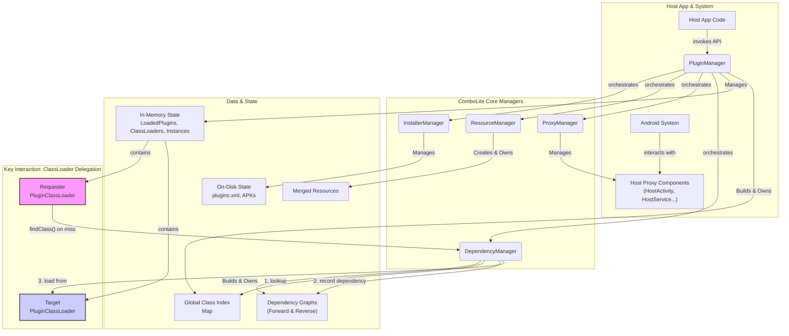

# Architecture & Design Principles

Welcome to the core of `ComboLite`!

This document aims to unveil the internal working mechanisms and core design philosophies of
`ComboLite`. By understanding the framework's underlying principles, you will be better able to
leverage its features and perform more efficient diagnostics when encountering issues.

`ComboLite`'s design philosophy is rooted in three cornerstones:

* **Ultimate Stability**: Completely abandoning non-public APIs (Hooks & Reflection) and using 100%
  officially recommended mechanisms to ensure the framework's long-term compatibility and
  reliability.
* **Embracing Modernity**: Natively designed for Jetpack Compose and Kotlin Coroutines, keeping in
  sync with the latest Android development toolchains.
* **Simplicity and Transparency**: Maintaining a concise and clear core logic to reduce the learning
  curve and secondary development costs for developers.

-----

## I. High-Level Architecture

`ComboLite` employs a simple yet powerful micro-kernel design, with several core managers working in
concert, each with its own responsibilities.

* **`PluginManager` (The Master Controller)**: The framework's supreme commander and sole singleton
  entry point. It is responsible for coordinating all other managers and controlling the **runtime
  state** (loading, instantiation, unloading) of all plugins.
* **`InstallerManager` (The Installer)**: The administrator of the plugin's "physical world." It
  handles the installation, update, and uninstallation processes, manages the storage of plugin APKs
  on disk, and maintains a metadata manifest (`plugins.xml`) of all installed plugins.
* **`ResourceManager` (The Resource Manager)**: The plugin's "visual" engine. It provides a unified
  `Resources` object by merging the resources of all loaded plugins, allowing the host and plugins
  to access any resource transparently.
* **`ProxyManager` (The Dispatcher)**: The "lifecycle agent" for the four major components. It is
  responsible for managing the host-side proxy components (like `HostActivity`, `HostService` pool)
  and correctly dispatching intents from the Android system to the corresponding plugin components.
* **`DependencyManager` (The Dependency Manager)**: The "relationship map" between plugins. It
  dynamically analyzes the dependencies between plugins during loading, constructing a directed
  graph to support "chain restart" and cross-plugin class lookups.

-----

## II. Core Workflow: The Life of a Plugin

Let's follow a plugin, starting from an APK file, through its entire lifecycle within `ComboLite`.

#### 1. Installation

When you call `PluginManager.installerManager.installPlugin(apkFile)`:

1. **Security Check**: `InstallerManager` first verifies that the **digital signature** of the
   `apkFile` matches that of the host app.
2. **Metadata Parsing**: Next, it parses the APK's `AndroidManifest.xml` to extract core metadata
   like `plugin.id`, `plugin.version`, etc., and validates them.
3. **Version Comparison**: If a plugin with the same ID already exists, it compares the version
   numbers, preventing downgrades by default.
4. **File Persistence**: After successful validation, `InstallerManager` copies the APK file to the
   application's private directory `/data/data/your.package/files/plugins/` and renames it, for
   example, to `com.example.myplugin.plugin`.
5. **Information Registration**: Finally, all of the plugin's metadata (including parsed static
   broadcasts and Provider info) is written to the application's "plugin registry"—the
   `/data/data/your.package/files/plugins.xml` file.

#### 2. Loading

When you call `PluginManager.launchPlugin("com.example.myplugin")`:

1. **Create Runtime Cache**: `PluginManager` first copies the plugin's persistent file to a
   temporary runtime cache directory (`/cache/plugins_runtime/`) and sets it to **read-only**. This
   is to avoid Android system warnings about writable `dex` files and to isolate each runtime
   instance.
2. **Build Class Index**: The framework uses the `dexlib2` library to scan this cached APK, extracts
   all class names, and builds a global `Map<ClassName, PluginId>` index. This index is key to
   achieving `O(1)` complexity for cross-plugin class lookups.
3. **Load Resources**: `ResourceManager` is called. It dynamically "merges" the resources from the
   plugin APK into the host's current `Resources` object, based on the Android system version (using
   `ResourcesLoader` for API 30+ and reflection for older versions).
4. **Create ClassLoader**: A dedicated `PluginClassLoader` instance is created for the plugin. It
   holds the path to the plugin and is responsible for subsequent class loading.
5. **Register Load Information**: A `LoadedPluginInfo` object, containing the plugin info,
   ClassLoader, etc., is created and stored in the `PluginManager`'s `loadedPluginsFlow` state.

#### 3. Instantiation

1. **Instantiate Entry Class**: `PluginManager` uses the newly created `PluginClassLoader` to load
   and instantiate the entry class (`IPluginEntryClass`) declared in the plugin's
   `AndroidManifest.xml`.
2. **Dependency Injection**: If the plugin provides Koin modules, the framework automatically loads
   them into the global Koin container.
3. **Lifecycle Callback**: The `onLoad()` method of the entry class instance is called, with a
   `PluginContext` passed in.
4. **Save Instance**: The plugin instance is stored in the `pluginInstancesFlow` state. At this
   point, the plugin is fully ready and can provide its services.

#### 4. Unloading

When you call `PluginManager.unloadPlugin("com.example.myplugin")`, the above process is reversed:

1. The `onUnload()` method is called.
2. Koin modules are unloaded.
3. The four major components are unregistered from `ProxyManager`.
4. Resources are removed from `ResourceManager`.
5. All classes of the plugin are removed from the global class index.
6. The records are removed from `loadedPluginsFlow` and `pluginInstancesFlow`.
7. The `PluginClassLoader` is discarded for garbage collection.
8. The runtime cache file is deleted.

-----

## III. The Four Components: Implementation Principles

#### Activity

Employs a **single placeholder proxy** model.

1. **Configuration**: You need to register a real `Activity` (e.g., `HostActivity`) that inherits
   from `BaseHostActivity` in the host's `Manifest`.
2. **Launch**: When you call `startPluginActivity(PluginActivity.class)`, the framework creates an
   `Intent` targeting the host's `HostActivity` but passes the real plugin `Activity` class name
   `"com.example.PluginActivity"` as an extra.
3. **Proxying**: The Android system starts `HostActivity`. In its `onCreate` method, it retrieves
   the class name from the `Intent` extra, instantiates the `IPluginActivity` object via the
   plugin's `ClassLoader`, calls its `onAttach(this)` to inject the proxy, and then manually calls
   its `onCreate()` and forwards all subsequent lifecycle events (`onResume`, `onPause`, etc.) to
   this plugin `Activity` instance.

#### Service

Employs a **proxy service pool** model.

1. **Configuration**: You need to register **multiple** real `Service` classes (e.g.,
   `HostService1`, `HostService2`...) in the host's `Manifest` and configure their `Class` list into
   the `ProxyManager`'s service pool.
2. **Launch**: When you call `startPluginService(PluginService.class, instanceId)`, `ProxyManager`
   fetches an **idle** `HostService` from the pool (e.g., `HostService2`) and binds the `instanceId`
   to it. The framework then creates an `Intent` targeting `HostService2`, passing the real plugin
   `Service` class name and `instanceId` as extras, and the system starts `HostService2`.
3. **Proxying**: After `HostService2` starts, it similarly instantiates the plugin `Service` and
   forwards all lifecycle events. When `HostService2` is destroyed, it notifies `ProxyManager` to
   return itself to the available pool for the next plugin `Service` to use.

#### BroadcastReceiver

Employs a **centralized proxy dispatch** model.

* **Static Broadcasts**:
    1. **Parsing**: During plugin **installation**, `InstallerManager` parses its `Manifest` to
       extract all `<receiver>` information (including `intent-filter`) and stores it in
       `plugins.xml`.
    2. **Registration**: During plugin **loading**, `PluginManager` registers this information into
       an in-memory registry in `ProxyManager`.
    3. **Receiving**: The **single** `HostReceiver` that you registered in the host's `Manifest`
       receives all system broadcasts.
    4. **Dispatching**: `HostReceiver` passes the received `Intent` to `ProxyManager`.
       `ProxyManager` then queries its internal registry to find all plugin `Receivers` that match
       the `Intent`, instantiates them one by one, and calls their `onReceive` methods.

#### ContentProvider

Employs a **URI proxy** model.

1. **Configuration**: You need to register a real `HostProvider` with a **unique Authority** (e.g.,
   `com.host.proxy.provider`) in the host's `Manifest`.
2. **Invocation**: When you call `queryPlugin(pluginUri)`, the extension function uses
   `buildProxyUri` to "transform" a plugin `Uri` (e.g., `content://plugin.auth/books`) into a proxy
   `Uri` (e.g., `content://com.host.proxy.provider/plugin.auth/books`).
3. **Proxying**: The system's `ContentResolver` sends the request to `HostProvider`. Upon receiving
   the request, `HostProvider` parses the original plugin `Authority` (`plugin.auth`) from the proxy
   `Uri`'s path, finds the corresponding real `ContentProvider` instance via `ProxyManager`, and
   forwards the request (using the original `Uri`) to the actual plugin `Provider` for processing.

-----

## IV. Key Mechanism Deep Dive

This section delves into some of `ComboLite`'s most distinctive designs, revealing their underlying
implementation principles.

### 1. Dynamic Dependency Discovery & ClassLoader Delegation

This is the core mechanism through which `ComboLite` achieves its "zero-configuration dependency"
and "lightning-fast class lookup" features. It is accomplished through the collaboration of three
components: the **Global Class Index**, the **`PluginClassLoader`**, and the **`DependencyManager`
**.

#### **Step 1: Global Class Index (The "Map") - O(1) Lookup**

During plugin loading, `PluginManager` uses the `dexlib2` library to scan the plugin APK and builds
a global `ConcurrentHashMap<ClassName, PluginId>` index. This index acts like a global phonebook,
clearly mapping "which class lives in which plugin." It optimizes the class lookup complexity from
`O(n)` in traditional plugin frameworks to `O(1)` hash lookups.

#### **Step 2: `PluginClassLoader` (The "Requester") - Initiating the Request**

Each plugin has its own `PluginClassLoader`. When code in Plugin A tries to load a class (e.g.,
`new ClassFromPluginB()`), its `ClassLoader` executes its overridden `findClass` method:

1. **Local Search**: First, like a normal `ClassLoader`, it searches for the class within its own
   `dex` file.
2. **Search Failure**: If not found locally, it does **not** immediately throw a
   `ClassNotFoundException`. Instead, it "delegates" the search task to the `DependencyManager`.
3. **Final Failure**: Only if the `DependencyManager` also fails to find the class does the
   `PluginClassLoader` throw a special `PluginDependencyException`, which carries the ID of the "
   culprit plugin." This exception is the key signal for implementing the "crash fusing" mechanism.

#### **Step 3: `DependencyManager` (The "Arbiter") - Arbitration and Recording**

As the implementation of the `IPluginFinder` interface, the `DependencyManager` acts as the "
arbiter" of the entire process. When it receives a class lookup request from Plugin A:

1. **Query Index**: It uses the class name to query the **global class index** and discovers that
   the class belongs to Plugin B.
2. **Record Dependency**: This is the most crucial step! `DependencyManager` dynamically records
   this dependency relationship in its **two internal dependency graphs**:
    * **Forward Dependency Graph**: `dependencyGraph` records `A -> B` (A depends on B).
    * **Reverse Dependency Graph**: `dependentGraph` records `B <- A` (B is depended on by A).
3. **Targeted Loading**: `DependencyManager` then retrieves Plugin B's `ClassLoader` and calls its
   `findClassLocally` method to directly load the required class from Plugin B's `dex` file,
   returning it to Plugin A. `findClassLocally` does not delegate again, thus avoiding infinite
   recursion.

This closed loop of "**Local Search -> Delegate to Arbiter -> Index Lookup -> Record Dependency ->
Targeted Loading**" elegantly achieves a fully dynamic, on-demand dependency recording system,
requiring no manual configuration from the developer.

### 2. Dependency Graph & Chain Restart

**"Chain Restart"** is `ComboLite`'s core safety mechanism to ensure state consistency after a hot
update. Its implementation relies entirely on the **reverse dependency graph (`dependentGraph`)**
dynamically built by the `DependencyManager` at runtime.

**How it works**:

1. **Trigger**: When you call `PluginManager.launchPlugin("plugin-B")` on an already loaded Plugin
   B, the framework identifies it as a "restart" request.
2. **Query Dependents**: `PluginManager` immediately calls
   `dependencyManager.findDependentsRecursive("plugin-B")`.
3. **Graph Traversal**: The `findDependentsRecursive` method performs a **Depth-First Search (DFS)**
   on the **reverse dependency graph**, starting from the `plugin-B` node, to find all plugins that
   directly or indirectly depend on `plugin-B` (e.g., `A` and `C`, where `C` depends on `A`, and `A`
   depends on `B`).
4. **Formulate Restart Plan**: The search result `[A, C]` is merged with the trigger point `B` to
   form a complete restart list `[A, B, C]`.
5. **Execute Plan**: `PluginManager` strictly follows the **reverse order of dependency** (first
   `C`, then `A`, finally `B`) to **unload** these plugins, and then reloads them in the **correct
   forward order**.

This automated, graph-traversal-based process ensures that an update to any underlying plugin will
cause all of its upstream dependents to be updated as well, thereby completely eliminating runtime
crashes caused by the mixing of old and new code.

### 3. Crash Fusing & Self-Healing

This is `ComboLite`'s "last line of defense," designed to prevent the entire application from
getting stuck in a crash loop due to a single plugin's dependency issue (e.g., forgetting to provide
a library after a host upgrade).

**How it works**:

1. **Signal**: When a `PluginClassLoader` fails to find a class anywhere, it throws a
   `PluginDependencyException`. This exception is the **sole signal** that triggers the fusing
   mechanism.
2. **Capture**: `PluginCrashHandler` registers itself as the global uncaught exception handler via
   `Thread.setDefaultUncaughtExceptionHandler` at app startup. Its `uncaughtException` method
   catches all unhandled exceptions.
3. **Precise Identification**: It recursively traverses the exception chain (`Throwable.cause`),
   specifically looking for `PluginDependencyException`. If it's another type of crash (like
   `NullPointerException`), it passes the exception to the system's default handler, allowing the
   app to crash normally.
4. **Execute Fusing**: Once a `PluginDependencyException` is identified, the handler will:
    * Extract the ID of the "culprit plugin" (`culpritPluginId`) from the exception object.
    * Call `PluginManager.setPluginEnabled(culpritPluginId, false)`, **persistently** changing the
      plugin's startup state to disabled.
    * Launch a friendly `CrashActivity` error page to inform the user that a functional module has
      been temporarily disabled and guide them to restart the app, instead of letting the app crash
      or enter a restart loop.

Through this process of "**Specific Exception Signal -> Global Capture -> Precise Identification ->
Automatic Disabling -> Friendly Prompt**," `ComboLite` transforms a potentially fatal error that
could paralyze the application into an isolated, auto-recoverable, and localized issue, greatly
enhancing the application's robustness.

-----

## V. Key Design Decisions

* **Why Zero Hooks?**
  For **ultimate stability and future compatibility**. As the Android system increasingly restricts
  non-public APIs, any hook-based solution faces a significant risk of failing on new system
  versions. `ComboLite` chose a more "difficult" but correct path, relying entirely on official
  public APIs and the proxy pattern. While it trades a small amount of flexibility (e.g., for
  complex `launchMode`s), it gains rock-solid long-term reliability in return.

* **Why the Class Index?**
  For **lightning-fast cross-plugin class lookup performance**. Traditional plugin frameworks often
  need to traverse a linked list of multiple `ClassLoader`s to find a class, an `O(n)` operation
  that performs poorly with a large number of plugins. `ComboLite` pre-scans all classes at plugin
  load time and builds a global `HashMap` index, reducing the time complexity of class lookups to
  `O(1)` and ensuring the application runs smoothly.

* **Why "Chain Restart"?**
  For **state consistency after hot updates**. In a complex dependency web, updating a low-level
  core plugin without restarting its upstream dependents can easily lead to crashes like
  `NoSuchMethodError` caused by mixed old and new code. The `Chain Restart` mechanism uses
  `DependencyManager` to automatically analyze all affected plugins and updates them as a single "
  atomic operation," fundamentally eliminating state inconsistency issues.

* **Why Merged Resources, Not Isolated?**
  For an **excellent developer experience**. Strict resource isolation is extremely complex to
  implement and often unnecessary in most scenarios. `ComboLite`'s merged resource management allows
  developers to "forget" the origin of a resource and use resources from any plugin transparently,
  just as they would in a monolithic application. This greatly simplifies plugin development and UI
  collaboration. Of course, this also requires developers to follow good resource naming conventions
  to avoid conflicts.